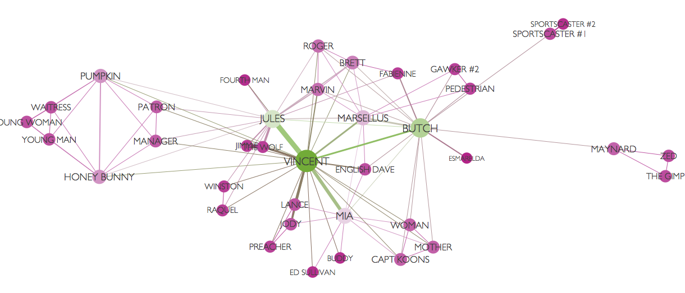
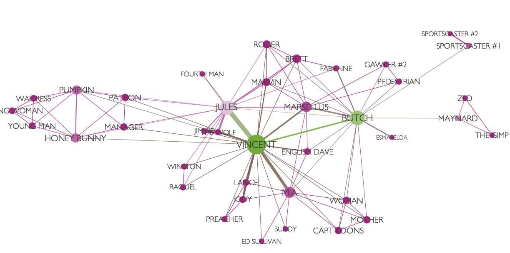

# Pagerank y análisis de redes

## Introducción

**Pagerank** asigna un número real a cada página de una red (web). Este número es un indicador de su importancia. Las ideas fundamentales son: 

- Las páginas de internet forman una red o gráfica, donde los nodos son las páginas y las aristas dirigidas son las ligas de unas páginas a otras.
- La importancia de un página A depende de cuántas otras páginas apuntan a la página A. También depende de qué tan importantes sean las páginas que apuntan a A.
- Cuando hacemos una búsqueda, primero se filtran las páginas que tienen el contenido
de nuestra búsqueda, y después los resultados se ordenan según el pagerank
de estas páginas filtradas.
- ¿Qué problema resuelve? En un principio, se usaron métodos como índices y recuperación de documentos usando técnicas como tf-idf. El problema es que es muy fácil que un *spammer* sesgue los resultados para que sus páginas tengan alto nivel de relevancia en este sentido. Así que la importancia no se juzga sólo con el contenido,  sino de los *votos* de otras páginas importantes. Este es un sistema más difícil de engañar.

- Es crucial usar la importancia de los *in-links* de una página; si no, sería tambíen fácil crear muchas páginas spam que apunten a otra dada para aumentar
su importancia.

El *Pagerank*, más en general, es una medida de *centralidad* o *importancia* de los nodos de una red dirigida. Comenzaremos considerando redes más variadas (por ejemplo, redes sociales) y el concepto general de *centralidad*.

### Centralidad en redes 

Consideremos una red de personas, que representamos como una gráfica $G$ no dirigida o dirigida, dependiendo del caso. Las personas son los nodos y sus relaciones se representan con aristas.

Quiséramos construir una medida de importancia o centralidad de una persona dentro de la red. Por ejemplo:

- Redes sociales de internet: las ligas representan relación de *amigos*,
o la de *seguidor*.  Importancia: número de amigos o seguidores (grado de entrada o salida).
- Redes de citas bibliográficas: las ligas representan quién comparte o usa la información de quién. Importancia: número de citas o usos, ser citado por alguien importante, etc. 
- Red de empleados de una oficina: las ligas representan interacciones en algún periodo. Importancia: quién puede conectar de manera más inmediata a dos personas.


### Ejemplo de Moviegalaxies.com: Pulp Fiction {-}

 Dos personajes están ligados si tienen interacciones en la película. El tamaño y color de los nodos dependen de su "centralidad" en la red.



(Gráfica creada con *Gephi*).

## Tipos de redes y su representación

Una red es un conjunto de *nodos* conectados por algunas *aristas*. 
Las aristas pueden ser 

- Dirigidas: hay un nodo origen y un nodo destino.
- No dirigidas: una arista representa una conexión simétrica entre dos nodos.

Podemos representar redes de varias maneras. Una primera manera
es con una lista de pares de *vértices* o *nodos* 
que están conectados por una *arista*. Por ejemplo, para una red dirigida:

```{r, fig.width=4, fig.asp=0.7, message = FALSE, warning = FALSE}
library(tidyverse)
library(tidygraph)
library(ggraph)
aristas <- tibble(from = c(1, 1, 1, 1, 2), 
                      to =   c(2, 3, 4, 5, 3))
aristas
```

```{r}
red_tbl <- tidygraph::as_tbl_graph(aristas, directed = TRUE)
red_tbl
```

Que podemos visualizar como sigue:

```{r, fig.width = 6, fig.asp = 0.7}
graficar_red_dirigida <- function(red_tbl){
  ggraph(red_tbl) + 
    geom_edge_link(arrow = arrow(), end_cap = circle(4, 'mm')) +
    geom_node_point(size = 10, colour = 'salmon') +
    geom_node_text(aes(label = name)) +
    theme_graph() + coord_fixed()
}
graficar_red_dirigida(red_tbl)
```

También es posible representar una red mediante una **matriz de adyacencia**. 

La matriz de adyacencia para una red es la matriz $A$ tal que
$$A_{ij} = 1$$
si existe una arista de $i$ a $j$. En el caso no dirigido, $A$ es una
matriz simétrica.

```{r}
matriz_ad <- igraph::get.adjacency(red_tbl)
matriz_ad
```

Es más conveniente representar estas matrices como matrices ralas,
como veremos más adelante.

**Nota de R**: utilizamos el paquete *tidygraph* y **ggraph** para hacer manipulaciones de gráficas y graficación. Estos paquetes son extensiones
del paquete  *igraph*, que es el que contiene los algoritmos de visualización, procesamiento
y resumen de redes.


## Visualización de redes

Existen varios algoritmos para visualizar redes que revelan distintos aspectos de su estructura (ver por ejemplo *?layout* en R, en el paquete *igraph*). 

Por ejemplo, aquí construimos una red aleatoria, y hacemos un *layout* de
nodos aleatorio:

```{r, fig.width = 6, fig.asp = 0.7}
set.seed(1234)
g <- play_erdos_renyi(n = 20, p = 0.1, directed = FALSE) %>% as_tbl_graph()
ggraph(g, layout = 'randomly') + geom_edge_link() +
  geom_node_point(size = 2, colour = 'salmon') +
  theme_graph()
```

Y comparamos con la representación producida por un algoritmo basado en fuerzas.

```{r, fig.width = 6, fig.asp = 0.7}
ggraph(g, layout = 'fr') + geom_edge_link() +
    geom_node_point(size = 2, colour = 'salmon') +
    theme_graph()
```

```{block2, type='resumen'}
Los algoritmos basados en fuerzas para representar redes en $2$ o $3$ dimensiones se basan principalmente en la siguiente idea:

- Las aristas actúan como resortes, que no permiten que nodos ligados se alejen mucho
- Los nodos tienen fuerzas de repulsión entre ellos (la analogía física es de cargas elécricas), y también a veces de gravedad entre ellos.
- El algoritmo de representación intenta minimizar la energía de la configuración del sistema de atracciones y repulsiones.
```

Hay muchas variaciones de estos algoritmos, por ejemplo: *graphopt* en *igraph*, 
*fruchtermann-rheingold*, *kamada-kawai*, *gem*, *escalamiento multidimensional*, *forceAtlas*,
etc. Intenta mover los nodos de las siguiente gráfica para entender el funcionamiento
básico de estos algoritmos:

```{r}
library(visNetwork)
edges <- g %>% activate(edges) %>% as_data_frame
set.seed(13)
red_vis <- visNetwork(nodes = data_frame(id = 1:20, label = 1:20), 
           edges, width = "100%") %>%
  visPhysics(solver ='forceAtlas2Based', 
             forceAtlas2Based = list(gravitationalConstant = - 50, # negativo!
                              centralGravity = 0.01, 
                              springLength = 100,
                              springConstant = 0.08,
                              avoidOverlap = 0
                              ))
red_vis
```


### Ejercicio
- Para la gráfica anterior, busca qué parámetros
puedes cambiar en el algoritmo y experimenta cambiándolos (cuánta repulsión, rigidez
de los resortes, número de iteraciones, etc.)


Otras familias de algoritmos intentan distintas estrategias, como los layout
de círculo, estrella, para árboles, etc.

```{r, fig.width = 6, fig.asp = 0.7}
ggraph(g, layout = 'circle') +
  geom_edge_link() +
  geom_node_point(size = 2, colour = 'salmon') +
  theme_graph()
```

## Medidas de centralidad para redes

Como discutimos arriba, las medidas de centralidad en redes intentan capturar
un concepto de importancia o conectividad de un nodo en una red. Primero comenzamos
con el caso **no dirigido**. Medidas básicas de centralidad son


- **Grado** o grado de entrada/salida: cuántas ligas tiene un nodo (no dirigidos, de entrada o de salida). 

- **Betweeness**: qué tan importante o único es un nodo para conectar otros pares
de nodos de la red (por ejemplo, una persona con betweeness alto controla más fácilmente el flujo de información en una red social). 
- **Cercanía**: qué tan lejos en promedio están los otros nodos de la red (pues puede encontrar y conectar más fácilmente otras dos nodos en la red).

- **Centralidad de eigenvector/Pagerank**: la centralidad de un nodo es una especie de promedio de la centralidad de sus vecinos.

### Grado

Sea $G$ una gráfica **no dirigida**, y sea $A$ la matriz de adyacencia de $G$.
Si $i$ es un nodo (vértice) dado, entonces su grado es

$$c_G(i)=\sum_{j\neq i} A_{i,j}.$$
que cuenta cúantas aristas conectan con el nodo $i$.

```{r}
graficar_red_nd <- function(dat_g){
  ggraph(dat_g, layout = 'kk') +
  geom_edge_link(alpha=0.2) +
  geom_node_point(aes(size = importancia), colour = 'salmon') +
  geom_node_text(aes(label = nombre), nudge_y = 0.2, size=3) +
  theme_graph(base_family = 'sans')
}

g_grado <- g %>% activate(nodes) %>%
  mutate(importancia = centrality_degree()) %>%
  mutate(nombre = 1:20) 

graficar_red_nd(g_grado)
```


#### ¿Qué no captura el grado como medida de centralidad? {-}

```{block2, type='resumen'}
El **grado** es una medida local que no toma en cuenta la topología más global
de la red: cómo están conectados nodos más lejanos alrededor del nodo que nos interesa.
```

#### Distancia a otros nodos {-}

En primer lugar, por ejemplo, no captura que algunos nodos están más cercanos en 
promedio a los nodos de la red que otros.

```{r}
g_simple <- igraph::graph(c(1, 2, 2, 3, 3, 4, 4, 5), directed = FALSE) %>% 
  as_tbl_graph() %>%
  mutate(importancia = centrality_degree()) %>%
  mutate(nombre  = LETTERS[1:5])
graficar_red_nd(g_simple)
```

Obsérvese en este ejemplo que el nodo $C$ es más importante que $D$, en el sentido
de que está más cercano a los nodos de toda la red, aún cuando el grado es el mismo
para ambos.


#### Caminos que pasan por un nodo {-}

En la siguiente gráfica, el nodo $G$ es importante porque es la única conexión
entre dos partes de la red, y esto no lo captura el grado:

```{r}
triangulo_1 <- c(1,2,2,3,3,1)
triangulo_2 <- triangulo_1 + 3
red_3 <- igraph::graph(c(triangulo_1, triangulo_2, c(7,1,7,4)), directed = FALSE) %>% 
  as_tbl_graph() %>%
  mutate(importancia = centrality_degree()) %>%
  mutate(nombre  = LETTERS[1:7])
graficar_red_nd(red_3)
```

#### Nodos conectados a otros nodos importantes {-}

En la siguiente gráfica el nodo $H$ tienen el mismo grado que $F$, pero
$H$ está conectado a un nodo más importante ($A$)
```{r}
red_4 <- igraph::graph(c(2,1,3,1,4,1,5,1,2,3,6,2,1,7,1,8), directed=FALSE) %>% 
  as_tbl_graph() %>%
  mutate(importancia = centrality_degree()) %>%
  mutate(nombre  = LETTERS[1:8])
graficar_red_nd(red_4)
```


### Medida de centralidad: *Betweeness*

La medida de centralidad *betweeness* de un nodo $i$ se define como:
$$c_b (u) = \sum_{j<k, u\neq j,u\neq i} \frac{ g(j,k |u)}{ g(j,k)},$$
donde

- $g(j,k)$ es el número de caminos más cortos distintos entre $j$ y $k$ y 
- $g(j,k |i)$ es el número de caminos más cortos distintos entre $j$ y $k$ que pasan por $i$. 
- $g(j,k | i ) = 0$ cuando $j=i$ o $k=i$.

- Los caminos que más aportan al betweeness de un nodo $i$ son los que no tienen otra alternativa más que pasar por $i$.

Esta medida se puede normalizar poniendo ($n$ es el total de nodos de la red)
$$\overline{c}_b (i)=c_b (i)/\binom{n-1}{2},$$
pues el denominador es el máximo valor de betweeness que puede alcanzar un vértice
en una red de $n$ nodos. 

#### Ejemplo {-}

```{r, fig.width=4, align='center'}
red_4 <- igraph::graph(c(2,1,3,1,4,1,5,1,2,3,6,2,2,5,1,6,6,7), directed = FALSE) %>% 
  as_tbl_graph() %>%
  mutate(importancia = centrality_betweenness()) %>%
  mutate(nombre  = LETTERS[1:7])
graficar_red_nd(red_4) + labs(subtitle = 'Betweeness')
```

Por ejemplo, consideremos el nodo $B$. Hay dos caminos más
cortos de $C$ a $F$ (de tamaño $2$), y uno de ellos pasa por $B$. 
De modo que los caminos de $C$ a $F$ aportan $0.5$ al *betweeness*
de $B$. De los caminos más cortos entre $E$ y $D$, ninguno pasa
por $B$, así que este par de vértices aporta $0$ al *betweeness*.
Verifica el valor de betweeness para $B$ haciendo los cálculos
restantes:


```{r}
red_4 %>% as_data_frame
```

#### Ejemplo de grado y betweeness: Pulp Fiction {-}

En esta red, el color es una medición de betweeness y el tamaño del nodo una medición del grado.
Aunque Butch y Jules tienen grados similares, Butch tiene *betweeness* más alto
pues provee más ligas únicas más cortas 
entre los personajes, mientras que la mayoría de los de Jules
pasan también por Vincent.




### Medida de centralidad: Cercanía

También es posible definir medidas de importancia según el promedio de cercanía a todos
los nodos. Éste se calcula como el inverso del promedio de distancias del nodo a todos los demás.

#### Ejemplo {-}
```{r}
red_5 <- igraph::graph(c(2,1,3,1,4,9,5,2,2,3,6,1,7,8,
                 8,9,9,1,1,8,1,7), 
               directed = FALSE)
```

```{r}
red_5 <- red_5 %>% as_tbl_graph() %>%
  mutate(importancia = centrality_closeness(normalized = TRUE)) %>%
  mutate(nombre  = LETTERS[1:9])
red_5 %>% activate(nodes) %>% as_data_frame
graficar_red_nd(red_5) + labs(subtitle = 'Cercanía')
```
En este ejemplo, el nodo $F$ tiene cercanía más alta que $D$, por ejemplo,
pues se conecta a un nodo bien conectado de la red (en grado y betweeness):

#### Ejercicio {-}
Verifica que la cercanía de $A$ es $0.80$.

### Centralidad de eigenvector

Esta medida considera que la importancia de un nodo está dado por la suma 
normalizada de las
importancias de sus vecinos. De esta forma, es importante estar cercano a nodos importantes (como en cercanía), pero también cuenta conectarse a muchos nodos (como en grado).

- Nótese que esta es una descripción circular: para saber la importancia de un nodo, hay que saber la importancia de sus vecinos.

Consideremos el ejemplo siguiente:


```{r, fig.height=3}
red_6 <- igraph::graph(c(1,2,1,3,1,4,5,2), directed = FALSE) %>%
  as_tbl_graph() %>% mutate(nombre = 1:5, importancia = 0)
graficar_red_nd(red_6) + theme(legend.position="none")+ labs(subtitle = 'Eigenvector')
```

Supongamos que las importancias  de estos $5$ nodos son
$$(x_1,\ldots, x_5)$$
donde $x_i\geq 0$.  

Por ejemplo, en una red con dos
nodos conectados los dos nodos deben tener la misma importancia.

De acuerdo a la idea mencionada arriba, calculamos entonces cómo se ve la suma de las importancias de nodos adyacentes a cada nodo. Para el nodo uno,

$${y_1} = x_2 + x_3 + x_4$$


para el nodo $2$ 

$$y_2 = x_1 + x_5$$

y para los siguientes nodos tendríamos
$$y_3 =  x_1$$
$$y_4 =  x_1$$
$$y_5 = x_2$$.

Este sistema lo podemos escribir de forma matricial, usando
la matriz de adyacencia, como

\[ y = 
\left (
\begin{array}{rrrrr}
 0 & 1 & 1 & 1 & 0 \\ 
 1 & 0 & 0 & 0 & 1 \\ 
  1 & 0 & 0 & 0 & 0 \\ 
  1 & 0 & 0 & 0 & 0 \\ 
  0 & 1 & 0 & 0 & 0 \\ 
\end{array}
\right ) x
\]


**Por definición de las importancias**, si normalizamos este vector $y$ debemos obtener las importancias originales:

$$\frac{1}{\lambda}y = x$$

Donde $\lambda\geq 0$ es el factor de normalización. En resumen, $x\geq 0$ debe satisfacer, para alguna $\lambda > 0$, la
ecuación 
$$y = A^t x = \lambda x,$$

es decir, $x$ **es un vector propio de la matriz de adyacencia con valor propio positivo.**

Sin embargo, ¿cuando existe un vector $x\geq 0$ con $\lambda>0$ que satisfaga esta propiedad?

#### Ejercicio {-}
Resuelve el sistema de ecuaciones de arriba y verifica que tal vector existe.
¿Cuál es el valor de lambda?


#### Matrices no negativas {-}

Para entender la existencia y forma de la centralidad de eigenvector,
comenzamos recordando algunos teoremas básicos de álgebra lineal. En primer
lugar, tenemos:

```{block2, type='resumen'}
**Espectro de matrices no-negativas**

Si $A$ es una matriz no negativa,  entonces:

- Existe un valor
propio real *no-negativo* $\lambda_0$ tal que $\lambda_0\geq |\lambda|$ para cualquier otro valor propio $\lambda$ de $A$. 
- Al valor propio $\lambda_0$ está asociado a uno (o varios) vector propio $x$ con entradas no negativas. 
```

Nota: Parte de este teorema se puede entender observando que si $A$ es no-negativa, entonces
mapea el cono $\{(x_1,x_2,\ldots, x_m) | x_i \geq 0\}$ dentro de sí mismo,
lo que implica que debe dejar invariante alguna dirección dentro de este cono.

Si este vector propio no-negativo fuera único (hasta normalización) y distinto del
vector $0$, entonces esto nos daría un conjunto de medidas (únicas hasta normalización) $x$ para la importancia de los nodos:

#### Ejemplo 1 {-}

```{r fig.width=3, fig.asp=1, out.width="200px", out.height="200px"}
par(mar=c(0,0,0,0)); plot(red_6, vertex.size = 40)
A_red <- igraph::get.adjacency(red_6)
A_red
```


```{r}
desc_A <- eigen(A_red)
print(desc_A, digits = 2)
```

Las medida de centralidad de eigenvector da entonces, en este caso:

```{r fig.width=3, fig.asp=1, out.width="200px", out.height="200px"}
x <- desc_A$vectors[,1]
print(x, digits = 2)
par(mar=c(0,0,0,0)); plot(red_6, vertex.size  = 100*x)
```


#### Ejemplo 2 {-}

Sin embargo, puede ser que obtengamos más de un valor propio no negativo con
vectores asociados no negativos, por ejemplo:


```{r fig.width=3, fig.asp=1, out.width="200px", out.height="200px", message =FALSE}
red <- igraph::graph(c(1,2,2,3,3,1,2,4,5,6), directed = FALSE)
par(mar=c(0,0,0,0)); plot(red, vertex.size=20)
A_red <- igraph::get.adjacency(red)
A_red
```


Nótese que los eigenvectores $1$ y $2$ son no negativos, y están asociados a 
vectores propios no negativos:
```{r}
desc_A <- eigen(A_red)
print(desc_A, digits = 2)
```

En este caso, la medida de centralización dependería de qué
peso le ponemos al primer vector propio vs el segundo vector propio. En este
ejemplo, la unicidad no sucede pues la red asociada no es conexa.

### Matrices irreducibles y gráficas fuertemente conexas {-}

¿Cuándo podemos garantizar unicidad en la solución de $Ax=\lambda x$ con $\lambda >0$ y que $x$ sea un vector no-negativo distinto de $0$?

Sea $A$ la matriz de adyacencia de una gráfica **no dirigida**.
  
-  Si la gráfica asociada a $A$ es fuertemente conexa (existen caminos entre cualquier par de vértices) entonces decimos que $A$ es **irreducible**.
- Podemos dar también una definición de irreducibilidad sólo en términos
de $A$: $A$ es irreducible cuando para toda $i,j$ existe $m\geq 0$ tal
que $(A^m)_{i,j} > 0$.

*Nota*: discute por qué estas dos definiciones son equivalentes.

Utilizaremos uno de los teoremas más importantes del
álgebra lineal:


```{block2, type='resumen'}
**Teorema de Perron-Frobenius**
  
Si $A$ es una matriz no-negativa irreducible, entonces

- Existe un valor
propio real *positivo* simple $\lambda_0$ tal que $\lambda_0 > |\lambda|$ para cualquier otro valor propio $\lambda$ de $A$, asociado a un vector propio $x$ con entradas positivas.
- No existe ningún otro vector propio con entradas no negativas que no sea paralelo a $x$.
```

Y entonces podemos definir una medida única de centralidad módulo una constante multiplicativa.

```{block2, type="resumen"}
Si $A$ es la matriz de adyacencia de una red no dirigida, y $A$ es irreducible (significa que la red es fuertemente conexa), definimos
la **centralidad de eigenvector** de un nodo $i$ como la $i$-esima componente
del vector positivo $x$ (con $\sum x_i = 1$)
asociado al valor propio (único) de Perron-Frobenius. 
```

#### Ejemplo: facultad de tres universidades {-}

```{r}
install.packages('igraphdata')
library("igraphdata")
data("UKfaculty")
ukf.und <- igraph::as.undirected(UKfaculty) 
head(dat_1 <- igraph::get.data.frame((ukf.und)))
grupo <- igraph::get.vertex.attribute(UKfaculty, 'Group')
nodos <- data.frame(id = 1:length(grupo))

visNetwork(nodos, dat_1, width = "100%") %>%
  visPhysics(solver ='forceAtlas2Based', 
             forceAtlas2Based = list(gravitationalConstant = -10),
             stabilization = TRUE)
```


Ahora calculamos centralidad de eigenvector.

```{r fig.width=3, fig.asp=1, out.width="200px", out.height="200px"}
A <- igraph::get.adjacency(ukf.und)
desc_A <- eigen(as.matrix(A))
desc_A$values
```

```{r}
vec <- as.numeric(desc_A$vector[,1])
desc_A$values[1]
e_vector <- -vec
qplot(e_vector,xlab="Primer vector propio",main="Importancia por centralidad de eigenvector")+theme(plot.title = element_text(hjust=0.5))
```

```{r}
colores <- colorRampPalette(c('red','green'))
colores_1 <- colores(length(e_vector))
nodos <- data.frame(id=1:length(vec), value = e_vector, 
                    color = colores_1[rank(e_vector)])

visNetwork(nodos, dat_1 %>% select(-weight), 
           width = "100%") %>%
  visPhysics(solver ='forceAtlas2Based', 
             stabilization = TRUE) %>%
  visNodes(value = 1, scaling = list(min = 1, max = 200))
```

Podemos calcular también usando *gggraph*:

```{r}
uk_tbl <- ukf.und %>% as_tbl_graph() %>%
  activate(nodes) %>%
  mutate(nombre = 1:nrow(as_data_frame(.))) %>%
  mutate(importancia = centrality_eigen())
ggraph(uk_tbl, layout = 'fr') +
  geom_edge_link(alpha=0.2) +
  geom_node_point(aes(size = importancia), colour = 'salmon') +
  theme_graph(base_family = 'sans')
```


