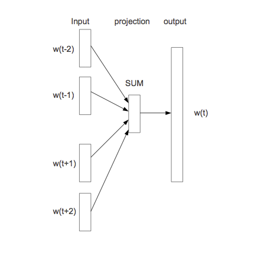
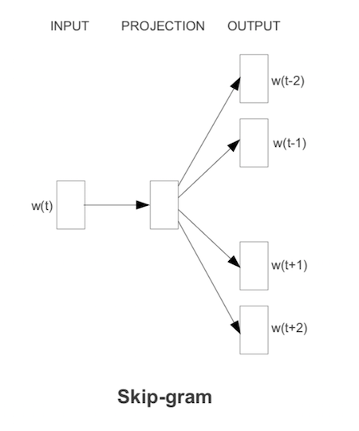

# Representación de palabras y word2vec

En esta parte empezamos a ver los enfoques más modernos (redes neuronales) para construir
modelos de lenguajes y resolver tareas de NLP. Se trata de modelos de lenguaje que incluyen más 
estructura, son más fáciles de regularizar y de ampliar si es necesario para incluir
dependencias de mayor distancia. El método de conteo/suavizamiento de ngramas es simple y funciona 
bien para algunas tareas, pero podemos construir mejores modelos con enfoques más estructurados, y con
más capacidad para aprender aspectos más complejos del lenguaje natural. 

Un enfoque que recientemente se ha vuelto más importante es el de redes neuronales. Si $w=w_1w_2\cdots w_N$ es una frase, y las $w$ representan palabras, recordemos que un modelo de lenguaje con dependencia de $n$-gramas consiste de las probabilidades

$$P(w_t | w_{t-1} w_{t-2} \cdots w_{t-n+1}),$$

 (n=2, bigramas, n=3 trigramas, etc.)

Y vimos que tenemos problemas cuando observamos sucesiones que no vimos en el corpus de entrenamiento. Este problema se puede "parchar" utilizando técnicas de suavizamiento. Aún para colecciones de entrenamiento muy grandes tenemos que lidiar con este problema.

Podemos tomar un enfoque más estructurado pensando en representaciones "distribucionales" de palabras:

1. Asociamos a cada palabra en el vocabulario un vector numérico con $d$ dimensiones, que es su *representación distribuida*.
2. Expresamos la función de probabilidad como combinaciones de 
las representaciones vectoriales del primer paso.
3. Aprendemos (máxima verosimiltud/con o sin regularización) simultáneamente los vectores y la manera de combinar 
estos vectores para producir probabilidades.

 La idea de este modelo es entonces subsanar la relativa escasez de datos (comparado con todos los trigramas que pueden existir) con estructura. Sabemos que esta es una buena estrategia si la estrucutura impuesta es apropiada.

```{block2, type='resumen'}
Una de las ideas fundamentales de este enfoque es representar
a cada palabra como un vector numérico de dimensión $d$. Esto
se llama una *representación vectorial distribuida*, o también
un *embedding de palabras*.
```

El objeto es entonces abstraer características de palabras (mediante estas representaciones) 
intentando no perder mucho de su sentido
original, lo que nos permite conocer palabras por su contexto, aún cuando no las hayamos observado antes.


### Ejemplo {-}

¿Cómo puede funcionar este enfoque? Por ejemplo, si vemos la frase "El gato corre en el jardín", sabemos que una frase probable debe ser también "El perro corre en el jardín", pero quizá nunca vimos en el corpus la sucesión "El perro corre". La idea es que como "perro" y "gato" son funcionalmente similares (aparecen en contextos similares en otros tipos de oraciones como el perro come, el gato come, el perro duerme, este es mi gato, etc.), un modelo como el de arriba daría vectores similares a "perro" y "gato", pues aparecen en contextos similares. Entonces el modelo daría una probabilidad alta a "El perro corre en el jardín".

## Modelo de red neuronal

Podemos entonces construir una red neuronal con 2 capas ocultas como sigue (segimos [@bengio], una de
las primeras referencias en usar este enfoque). Usemos el ejemplo de trigramas:

1. En la primera capa oculta, tenemos un mapeo de las entradas $w_1,\ldots, w_{n-1}$ a $x=C(w_1),\ldots, C(w_{n-1})$, donde $C$ es una función que mapea palabras a vectores de dimensión $d$. $C$ también se puede pensar como una matriz de dimensión $|V|$ por $d$. En la capa de entrada,

$$w_{n-2},w_{n-1} \to x = (C(w_{n-2}), C(w_{n-1})).$$


2. En la siguiente capa oculta tenemos una matriz de pesos $H$ y la función logística (o tangente hiperbólica) $\sigma (z) = \frac{e^z}{1+e^z}$, como en una red neuronal usual. 

En esta capa calculamos
$$z = \sigma (a + Hx),$$
que resulta en un vector de tamaño $h$. 

3. La capa de salida debe ser un vector de probabilidades
sobre todo el vocabulario $|V|$. En esta capa tenemos pesos $U$ y hacemos
$$y = b + U\sigma (z),$$
y finalmente usamos softmax para tener probabilidades que suman uno:
$$p_i = \frac{\exp (y_i) }{\sum_j exp(y_j)}.$$

En el ajuste maximizamos la verosimilitud:

$$\sum_t \log \hat{P}(w_{t,n}|w_{t,n-2}w_{t-n-1}) $$ 


La representación en la referencia [@bengio] es:


Esta idea original ha sido explotada con éxito, aunque sigue siendo
intensivo en cómputo ajustar un modelo como este. Nótese que
el número de parámetros es del orden de $|V|(nm+h)$, donde $|V|$ es el tamaño del vocabulario (decenas o cientos de miles), $n$ es 3 o 4 (trigramas, 4-gramas), $m$ es el tamaño de la representacion (cientos) y $h$ es el número de nodos en la segunda capa (también cientos o miles).  Esto resulta en el mejor de los casos en modelos con miles de millones de parámetros. Adicionalmente, hay algunos cálculos costosos, como el softmax (donde hay que hacer una suma sobre el vocabulario completo). En el paper original se propone **descenso estocástico**.


### Ejemplo {-}
Veamos un ejemplo chico de cómo se vería el paso
feed-forward de esta red. Supondremos en este
ejemplo que los sesgos $a,b$ son
iguales a cero para simplificar los cálculos.

Consideremos que el texto de entrenamiento es
"El perro corre. El gato corre. El león corre. El león ruge."

En este caso, nuestro vocabulario consiste de los 8 tokens
$<s>$, el, perro, gato, león, corre, caza $</s>$. Consideremos un
modelo con $d=2$ (representaciones de palabras en 2 dimensiones),
y consideramos un modelo de trigramas.

Nuestra primera capa es una matriz $C$ de tamaño $2\times 8$,
es decir, un vector de tamaño 2 para cada palabra. Por ejemplo,
podríamos tener
```{r, message=FALSE}
library(tidyverse)
set.seed(63)
C <- round(matrix(rnorm(16, 0, 0.1), 2, 8), 2)
colnames(C) <- c("_s_", "el", "perro", "gato", "león", "corre", "caza", "_ss_")
rownames(C) <- c("d_1", "d_2")
C
```

En la siguiente capa consideremos que usaremos, arbitrariamente, $h=3$ unidades. Como estamos considerando bigramas, necesitamos una entrada de tamaño 4 (representación de un bigrama, que son dos vectores de la matriz $C$)

```{r}
H <- round(matrix(rnorm(12, 0, 0.1), 3, 4), 2)
H
```

Y la última capa es la del vocabulario. Son entonces 8 unidades,
con 3 entradas cada una. La matriz de pesos es:

```{r}
U <- round(matrix(rnorm(24, 0, 0.1), 8, 3), 2)
rownames(U) <- c("_s_", "el", "perro", "gato", "león", "corre", "caza", "_ss_")
U
```

Ahora consideremos cómo se calcula el objetivo con los
datos de entrenamiento. El primer trigrama es (\_s\_, el, perro). La primera
capa entonces devuelve los dos vectores correspondientes a cada
palabra (concatenado):

```{r}
capa_1 <- c(C[, "_s_"], C[, "el"])
capa_1
```

La siguiente capa es:

```{r}
sigma <- function(z){ 1 / (1 + exp(-z))}
capa_2 <- sigma(H %*% capa_1)
capa_2
```

Y la capa final da

```{r}
y <- U %*% capa_2
y
```

Y aplicamos softmax para encontrar las probabilidades

```{r}
p <- exp(y)/sum(exp(y)) %>% as.numeric()
p
```

Y la probabilidad es entonces

```{r}
p_1 <- p["perro", 1]
p_1
```

Cuya log probabilidad es

```{r}
log(p_1)
```

Ahora seguimos con el siguiente trigrama, que
es "(el, perro, corre)". Necesitamos calcular la probabilidad
de corre dado el contexto "el perro". Repetimos nuestro cálculo:

```{r}
capa_1 <- c(C[, "el"], C[, "perro"])
capa_1
capa_2 <- sigma(H %*% capa_1)
capa_2
y <- U %*% capa_2
y
p <- exp(y)/sum(exp(y)) %>% as.numeric()
p
```

Y la probabilidad es entonces

```{r}
p_2 <- p["corre", 1]
log(p_2)
```

Sumando, la log probabilidad es:

```{r}
log(p_1) + log(p_2)
```

y continuamos con los siguientes trigramas del texto de entrenamiento.
Creamos una función

```{r}
feed_fow_p <- function(trigrama, C, H, U){
  trigrama <- strsplit(trigrama, " ", fixed = TRUE)[[1]]
  capa_1 <- c(C[, trigrama[1]], C[, trigrama[2]])
  capa_2 <- sigma(H %*% capa_1)
  y <- U %*% capa_2
  p <- exp(y)/sum(exp(y)) %>% as.numeric()
  p
}

feed_fow_trigrama <- function(trigrama, C, H, U) {
  p <- feed_fow_p(trigrama, C, H, U)
  trigrama_s <- strsplit(trigrama, " ", fixed = TRUE)[[1]]
  log(p)[trigrama_s[3], 1]
}
```

Y ahora aplicamos a todos los trigramas:

```{r}
texto_entrena <- c("_s_ el perro corre _ss_", " _s_ el gato corre _ss_", " _s_ el león corre _ss_",
  "_s_ el león caza _ss_",  "_s_ el gato caza _ss_")
entrena_trigramas <- map(texto_entrena, 
  ~tokenizers::tokenize_ngrams(.x, n = 3)[[1]]) %>% 
  flatten %>% unlist
entrena_trigramas
```

```{r}
log_p <- sapply(entrena_trigramas, function(x) feed_fow_trigrama(x, C, H, U))
sum(log_p)
```

Ahora piensa como harías más grande esta verosimilitud. Observa
que "perro", "gato" y "león"" están comunmente seguidos de "corre".
Esto implica que nos convendría que hubiera cierta similitud
entre los vectores de estas tres palabras, por ejemplo:

```{r}
C_1 <- C
indices <- colnames(C) %in%  c("perro", "gato", "león")
C_1[1, indices] <- 3.0
C_1[1, !indices] <- -1.0
C_1
```

La siguiente capa queremos que extraiga el concepto "animal" en la palabra anterior, o algo
similar, así que podríamos poner en la unidad 1:

```{r}
H_1 <- H
H_1[1, ] <- c(0, 0, 5, 0)
H_1
```

Nótese que la unidad 1 de la segunda capa se activa 
cuando la primera componente de la palabra anterior es alta.
En la última capa, podríamos entonces poner

```{r}
U_1 <- U
U_1["corre", ] <- c(4.0, -2, -2)
U_1["caza", ] <- c(4.2, -2, -2)
U_1
```

que captura cuando la primera unidad se activa. Ahora el cálculo
completo es:

```{r}
log_p <- sapply(entrena_trigramas, function(x) feed_fow_trigrama(x, C_1, H_1, U_1))
sum(log_p)
```

Y logramos aumentar la verosimilitud considerablemente. Compara las probabilidades:

```{r}
feed_fow_p("el perro", C, H, U)
feed_fow_p("el perro", C_1, H_1, U_1)
feed_fow_p("el gato", C, H, U)
feed_fow_p("el gato", C_1, H_1, U_1)
```


**Observación**: a partir de este principio, es posible construir arquitecturas más 
refinadas que tomen en cuenta, por ejemplo,  relaciones más lejanas entre
partes de oraciones (no solo el contexto del n-grama), ver por ejemplo [el capítulo 10 del libro
de Deep Learning de Goodfellow, Bengio y Courville](https://www.deeplearningbook.org/contents/rnn.html).

Abajo exploramos una parte fundamental de estos modelos: representaciones de palabras, y modelos
relativamente simples para obtener estas representaciones.

## Representación de palabras

Un aspecto interesante de el modelo de arriba es que
nos da una representación vectorial de las palabras, en la forma
de los parámetros ajustados de la matriz $C$. Esta se puede entender
como una descripción numérica de cómo funciona una palabra en el contexto de su n-grama.

Por ejemplo, deberíamos encontrar que palabras como "perro" y "gato" tienen representaciones similares. La razón es que cuando aparecen,
las probabilidades sobre las palabras siguientes deberían ser similares, pues estas son dos palabras que se pueden usar en muchos contextos
compartidos.

También podríamos encontrar que palabras como perro, gato, águila, león, etc. tienen partes o entradas similares en sus vectores de representación, que es la parte que hace que funcionen como "animal mamífero" dentro de frases. 

Veremos que hay más razones por las que es interesante esta representación.


## Modelos de word2vec

Si lo que principalmente nos interesa es obtener la representación
vectorial de palabras, más recientemente se descubrió que es posible 
simplificar considerablemente el modelo de arriba para poder entrenarlo mucho más rápido, y obtener una representación que en muchas tareas se desempeña bien ([@word2vec]).

Hay dos ideas básicas que se pueden usar para reducir la complejidad del entrenamiento (ver más
en [@goodfellow] y [@word2vec]:

- Eliminar la segunda capa oculta: modelo de *bag-of-words* continuo y modelo de *skip-gram*.
- Cambiar la función objetivo (minimizar devianza/maximizar verosimilitud) por una más simple, mediante un truco que se llama *negative sampling*.

Como ya no es de interés central predecir la siguiente palabra a partir
de las anteriores, en estos modelos **intentamos predecir la palabra
central a partir de las que están alrededor**. 

### Arquitectura continuous bag-of-words

La entrada es igual que en el modelo completo. En primer lugar,
simplificamos la segunda capa oculta pondiendo en $z$ el promedio de
los vectores $C(w_{n-2}), C(w_{n-1})$.  La última capa la dejamos igual por el momento:



El modelo se llama bag-of-words porque todas las entradas de la primera capa oculta contribuyen de la misma manera en la salida, independientemente del orden. Aunque esto no suena como buena idea para construir un modelo de lenguaje, veremos que resulta en una representación adecuada para algunos problemas.

1. En la primera capa oculta, tenemos un mapeo de las entradas $w_1,\ldots, w_{n-1}$ a $x=C(w_1),\ldots, C(w_{n-1})$, donde $C$ es una función que mapea palabras a vectores de dimensión $d$. $C$ también se puede pensar como una matriz de dimensión $|V|$ por $d$. En la capa de entrada,

$$w_{n-2},w_{n-1} \to x = (C(w_{n-2}), C(w_{n-1})).$$


2. En la siguiente "capa"" oculta simplemente sumamos las entradas de $x$. Aquí nótese que realmente no hay parámetros.

3. Finalmente, la capa de salida debe ser un vector de probabilidades
sobre todo el vocabulario $|V|$. En esta capa tenemos pesos $U$ y hacemos
$$y = b + U\sigma (z),$$
y finalmente usamos softmax para tener probabilidades que suman uno:
$$p_i = \frac{\exp (y_i) }{\sum_j exp(y_j)}.$$

En el ajuste maximizamos la verosimilitud sobre el corpus. Por ejemplo, para una frase, su log verosimilitud es:

$$\sum_t \log \hat{P}(w_{t,n}|w_{t,n+1} \cdots w_{t-n-1}) $$

### Arquitectura skip-grams

Otro modelo simplificado, con más complejidad computacional pero
mejores resultados (ver [@word2vec]) que
el bag-of-words, es el modelo de skip-grams. En este caso, dada
cada palabra que encontramos, intentamos predecir un número
fijo de las palabras anteriores y palabras posteriores 
(el contexto es una vecindad de la palabra).




La función objetivo se defina ahora (simplificando) como suma sobre $t$:

$$-\sum_t \sum_{ -2\leq j \leq 2, j\neq 0} \log P(w_{t-j} | w_t)$$
(no tomamos en cuenta dónde aparece exactamente $w_{t-j}$ en relación a $w_t$, simplemente consideramos que está en su contexto),
donde

$$\log P(w_{t-j}|w_t) =  u_{t-j}^tC(w_n) - \log\sum_k \exp{u_{k}^tC(w_n)}$$

Todavía se propone una simplificación adicional que resulta ser efectiva:

### Muestreo negativo

La siguiente simplificación consiste en cambiar la función objetivo. En word2vec puede usarse "muestreo negativo".

Para empezar, la función objetivo original (para contexto de una sola palabra) es


$$E = -\log \hat{P}(w_{a}|w_{n}) = -y_{w_a} + \log\sum_j \exp(y_j),$$

donde las $y_i$ son las salidas de la penúltima capa. La dificultad está en el segundo término, que es sobre todo el vocabulario en incluye todos los parámetros del modelo (hay que calcular las parciales de $y_j$'s
sobre cada una de las palabras del vocabulario).


La idea del muestreo negativo es que si $w_a$ 
está en el contexto de $w_{n}$, tomamos una muestra de $k$ palabras
$v_1,\ldots v_k$ al azar
(2-50, dependiendo del tamaño de la colección), y creamos $k$
"contextos falsos" $v_j w_{n}$, $j=1\ldots,k$. Minimizamos
en lugar de la observación de arriba

$$E = -\log\sigma(y_{w_a}) + \sum_{j=1}^k \log\sigma(y_j),$$
en donde queremos maximizar la probabilidad de que ocurra
$w_a$ vs. la probabilidad de que ocurra alguna de las $v_j$.
Es decir, solo buscamos optimizar parámetros para separar lo mejor
que podamos la observación de $k$ observaciones falsas, lo cual implica que tenemos que mover un número relativamente chico de
parámetros (en lugar de todos los parámetros de todas las palabras del vocabulario). 

Las palabras "falsas" se escogen según una probabilidad ajustada
de unigramas (se observó empíricamente mejor desempeño cuando escogemos cada palabra con probabilidad proporcional a $P(w)^{3/4}$, en lugar de $P(w)$, ver [@word2vec]).


### Ejemplo {-}

```{r, message=FALSE, warning = FALSE}
if(!require(wordVectors)){
  devtools::install_github("bmschmidt/wordVectors")
}
library(wordVectors)
```

```{r}
library(tidyverse)
periodico <- read_lines(file= "../datos/noticias/Es_Newspapers.txt",
                        progress = FALSE)
normalizar <- function(texto, vocab = NULL){
  # minúsculas
  texto <- tolower(texto)
  # varios ajustes
  texto <- gsub("\\s+", " ", texto)
  texto <- gsub("\\.[^0-9]", " _punto_ ", texto)
  texto <- gsub(" _s_ $", "", texto)
  texto <- gsub("\\.", " _punto_ ", texto)
  texto <- gsub("[«»¡!¿?-]", "", texto) 
  texto <- gsub(";", " _punto_coma_ ", texto) 
  texto <- gsub("\\:", " _dos_puntos_ ", texto) 
  texto <- gsub("\\,[^0-9]", " _coma_ ", texto)
  texto <- gsub("\\s+", " ", texto)
  texto
}
periodico_df <- tibble(txt = periodico) %>%
                mutate(id = row_number()) %>%
                mutate(txt = normalizar(txt))
```


```{r prepw2v}
if(!file.exists('./salidas/noticias_w2v.txt')){
  tmp <- tempfile()
  # tokenización
  write_lines(periodico_df$txt,  tmp)
  prep <- prep_word2vec(tmp, 
          destination = './salidas/noticias_w2v.txt', bundle_ngrams = 2)
  } 
```

Construimos un modelo con vectores de palabras de tamaño 100,
skip-grams de tamaño 4, y ajustamos con muestreo negativo
de tamaño 20:

```{r modelow2v, message = FALSE, warning = FALSE, results=FALSE}
if (!file.exists("./salidas/noticias_vectors.bin")) {
  model <- train_word2vec("./salidas/noticias_w2v.txt", 
          "./salidas/noticias_vectors.bin",
          vectors = 100, threads = 4, window = 4, cbow = 0,  
          iter = 5, negative_samples = 20, min_count = 5) 
} else {
  model <- read.vectors("./salidas/noticias_vectors.bin")
}

```

```{bash}
ls -lah ./salidas
```


El resultado son los vectores aprendidos de las palabras, por ejemplo

```{r}
model[["gol"]] %>% as.numeric
```

## Espacio de representación de palabras {#esprep}

Como discutimos arriba, palabras que se usan en contextos
similares por su significado o por su función (por ejemplo, "perro" y "gato"") deben tener representaciones similares, pues su contexto tiende a ser similar. La distancia que usamos el similitud coseno.

Podemos verificar con nuestro ejemplo:

```{r sim1}
ejemplos <- model %>% closest_to("gol", n = 5)
ejemplos
```

```{r sim2}
model %>% closest_to("presidente", n = 5)
```

También podemos buscar varias palabras:

```{r}
palabras <- c("soleado", "nuboso", "lluvioso")
model %>% closest_to(palabras)
```

Que es lo mismo que:

```{r}
# extraer vectores de palabras y promediar
vectores <- map(palabras, ~ model[[.x]]) %>% 
  map(as.numeric) %>% bind_cols
media <- apply(as.matrix(vectores), 1, mean)
model %>% closest_to(t(media))
```

Podemos ver cómo se ven las palabras más similares a "lluvia" o "sol", 

```{r}
library(ggrepel)
vectores = model[[c("lluvia", "sol"),
                  average = F]]
sims <- model[1:5000,] %>%  # las 5000 palabras más comunes
        cosineSimilarity(vectores) %>%
        as.data.frame() %>%
        rownames_to_column() 
similares <- sims %>% filter_at(vars(-rowname), any_vars(. > 0.6))  
ggplot(similares, aes(x = lluvia, y = sol, label = rowname)) +
  geom_text_repel() + ylab("Similitud con sol") +
  xlab("Similitud con lluvia")
```


Ahora consideremos cómo se distribuyen las palabras en este
espacio, y si existe estructura geométrica en este espacio.

Consideremos primero el caso de plurales de sustantivos.

- Como el contexto de los plurales es distinto de los singulares,
nuestro modelo puede capturar en los vectores su diferencia.
- Examinamos entonces cómo son geométricamente
diferentes las representaciones de plurales vs singulares
- Si encontramos un patrón reconocible, podemos utilizar este patrón, por ejemplo,
para encontrar la versión plural de una palabra singular, *sin usar ninguna
regla del lenguaje*.

Una de las relaciones geométricas más simples es la adición de vectores. Por ejemplo,
extraemos la diferencia entre gol y goles:

```{r}
plural_1 <- model[["goles"]] - model[["gol"]]
plural_1
```

que es un vector en el espacio de representación de palabras. Ahora sumamos este vector
a un sustantivo en singular, y vemos qué palabras están cercas de esta "palabra sintética":

```{r}
vector <-  model[["partido"]] + plural_1
model %>% closest_to(vector, n = 5)
```

Nótese que la más cercana es justamente el plural correcto, o otros plurales con relación
al que buscábamos (como *encuentros*)

Otro ejemplo:

```{r}
plural_1 <- model[["días"]] - model[["día"]]
vector <-  model[["mes"]] + plural_1
model %>% closest_to(vector, n = 20) 
```


Veremos ahora cómo funciona para el género de sustantivos:

```{r}
fem_1 <- model[["presidenta"]] - model[["presidente"]]
vector <-  model[["rey"]] + fem_1
model %>% closest_to(vector, n = 5) %>% filter(word != "rey")
```
```{r}
vector <-  model[["tío"]] + fem_1
model %>% closest_to(vector, n = 5) %>% filter(word != "tío")
```

Y la relación adverbio - adjetivo también podemos considerarla:

```{r}
adv <- model[["lentamente"]] - model[["lento"]]
vector <-  model[["rápido"]] + adv
model %>% closest_to(vector, n = 10) %>% filter(word != "lentamente")
```

La evaluación de estas aplicaciones puede hacerse por ejemplo,
con una lista de singular/plurales, de adjetivos/adverbios, masculino/femenino, etc (ver [@word2vec]).

**Observación**: falta afinar los parámetros en este modelo.
Puedes probar cambiando negative sampling (por ejemplo, incrementa a 40), el número de vectores (50-200, por ejemplo), e incrementando *window* y el número de iteraciones.

Considera también un modelo preentrenado mucho más grande como [este](https://github.com/uchile-nlp/spanish-word-embeddings) y repite las tareas mostradas (el formato bin es estándar para la implementación que usamos de word2vec).

---

Podemos visualizar el espacio de representaciones reduciendo dimensionalidad. En este caso, utilizamos *tsne*:

```{r, out.width = "800px"}
library(tsne)
library(ggplot2)
library(ggrepel)
mat_vs <- model@.Data
# solo calculamos para las 500 palabras más comunes
num_palabras <- 500 
set.seed(1203)
vs_2 <- tsne(mat_vs[1:num_palabras, ], 
             max_iter = 1000, perplexity = 50)
```

```{r}
set.seed(823)
colnames(vs_2) <- c("V1", "V2")
df_vs <- as_tibble(vs_2, .name_repair = "check_unique") %>%
  mutate(palabra = rownames(mat_vs[1:num_palabras, ]))
ggplot(df_vs %>% sample_n(250), 
  aes(x = V1, y = V2, label = palabra)) +
  geom_point(colour = 'red', alpha = 0.3) +
  geom_text_repel(size = 2, force = 0.3, segment.alpha = 0.5) 
```

## Usos de representaciones distribuidas

La idea general de construir representaciones densas de las palabras
(en lugar de representaciones ralas, como codificación dummy o one-hot encoding) es una fundamental en varias tareas de procesamiento de lenguaje natural. Se utiliza en clasificación de textos (*fast-text* es similar
al modelo bag-of-words),
respuesta de preguntas, traducción automática, recuperación
de información, reconocimiento de entidades, etc. Word2vec también es usado para sistemas de recomendación (las palabras son artículos, las canastas son los textos).


