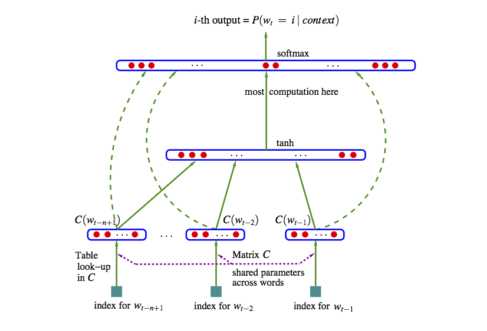

# Representación de palabras y word2vec

En esta parte empezamos a ver los enfoques más modernos (redes neuronales) para construir
modelos de lenguajes y resolver tareas de NLP. Se trata de modelos de lenguaje que incluyen más 
estructura, son más fáciles de regularizar y de ampliar si es necesario para incluir
dependencias de mayor distancia. El método de conteo/suavizamiento de ngramas es simple y funciona 
bien para algunas tareas, pero podemos construir mejores modelos con enfoques más estructurados, y con
más capacidad para aprender aspectos más complejos del lenguaje natural

Un enfoque que recientemente se ha vuelto más importante es el de redes neuronales. Si $w=w_1w_2\cdots w_N$ es una frase, y las $w$ representan palabras, recordemos que un modelo de lenguaje con dependencia de $n$-gramas consiste de las probabilidades

$$P(w_t | w_{t-1} w_{t-2} \cdots w_{t-n+1}),$$

 (n=2, bigramas, n=3 trigramas, etc.)

Y vimos que tenemos problemas cuando observamos sucesiones que no vimos en el corpus de entrenamiento. Este problema se puede "parchar" utilizando técnicas de suavizamiento. Aún para colecciones de entrenamiento muy grandes tenemos que lidiar con este problema.

Podemos tomar un enfoque más estructurado pensando en representaciones "distribucionales" de palabras:

1. Asociamos a cada palabra en el vocabulario un vector numérico con $d$ dimensiones, que es su *representación distribuida*.
2. Expresamos la función de probabilidad como combinaciones de 
las representaciones vectoriales del primer paso.
3. Aprendemos (máxima verosimiltud/con o sin regularización) simultáneamente los vectores y la manera de combinar 
estos vectores para producir probabilidades.

 La idea de este modelo es entonces subsanar la relativa escasez de datos (comparado con todos los trigramas que pueden existir) con estructura. Sabemos que esta es una buena estrategia si la estrucutura impuesta es apropiada.

```{block2, type='resumen'}
Una de las ideas fundamentales de este enfoque es representar
a cada palabra como un vector numérico de dimensión $d$. Esto
se llama una *representación vectorial distribuida*, o también
un *embedding de palabras*.
```

El objeto es entonces abstraer características de palabras (mediante estas representaciones) 
intentando no perder mucho de su sentido
original, lo que nos permite conocer palabras por su contexto, aún cuando no las hayamos observado antes.


### Ejemplo {#ejemplo}
¿Cómo puede funcionar este enfoque? Por ejemplo, si vemos la frase "El gato corre en el jardín", sabemos que una frase probable debe ser también "El perro corre en el jardín", pero quizá nunca vimos en el corpus la sucesión "El perro corre". La idea es que como "perro" y "gato" son funcionalmente similares (aparecen en contextos similares en otros tipos de oraciones como el perro come, el gato come, el perro duerme, este es mi gato, etc.), un modelo como el de arriba daría vectores similares a "perro" y "gato", pues aparecen en contextos similares. Entonces el modelo daría una probabilidad alta a "El perro corre en el jardín".

## Modelo de red neuronal

Podemos entonces construir una red neuronal con 2 capas ocultas como sigue. Usemos el ejemplo de trigramas:

1. En la primera capa oculta, tenemos un mapeo de las entradas $w_1,\ldots, w_{n-1}$ a $x=C(w_1),\ldots, C(w_{n-1})$, donde $C$ es una función que mapea palabras a vectores de dimensión $d$. $C$ también se puede pensar como una matriz de dimensión $|V|$ por $d$. En la capa de entrada,

$$w_{n-2},w_{n-1} \to x = (C(w_{n-2}), C(w_{n-1})).$$


2. En la siguiente capa oculta tenemos una matriz de pesos $H$ y la función logística (o tangente hiperbólica) $\sigma (z) = \frac{e^z}{1+e^z}$, como en una red neuronal usual. 

En esta capa calculamos
$$z = \sigma (a + Hx),$$
que resulta en un vector de tamaño $h$. 

3. La capa de salida debe ser un vector de probabilidades
sobre todo el vocabulario $|V|$. En esta capa tenemos pesos $U$ y hacemos
$$y = b + U\sigma (z),$$
y finalmente usamos softmax para tener probabilidades que suman uno:
$$p_i = \frac{\exp (y_i) }{\sum_j exp(y_j)}.$$

En el ajuste maximizamos la verosimilitud:

$$\sum_t \log \hat{P}(w_{t,n}|w_{t,n-2}w_{t-n-1}) $$ 


La representación en la referencia [@bengio] es:



Esta idea original ha sido explotada con éxito, aunque sigue siendo
intensivo en cómputo ajustar un modelo como este. Nótese que
el número de parámetros es del orden de $|V|(nm+h)$, donde $|V|$ es el tamaño del vocabulario (decenas o cientos de miles), $n$ es 3 o 4 (trigramas, 4-gramas), $m$ es el tamaño de la representacion (cientos) y $h$ es el número de nodos en la segunda capa (también cientos o miles).  Esto resulta en el mejor de los casos en modelos con miles de millones de parámetros. Adicionalmente, hay algunos cálculos costosos, como el softmax (donde hay que hacer una suma sobre el vocabulario completo). En el paper original se propone **descenso estocástico**.


### Ejemplo {-}
Veamos un ejemplo chico de cómo se vería el paso
feed-forward de esta red. Supondremos en este
ejemplo que los sesgos $a,b$ son
iguales a cero para simplificar los cálculos.

Consideremos que el texto de entrenamiento es
"El perro corre. El gato corre. El león corre. El león ruge."

En este caso, nuestro vocabulario consiste de los 8 tokens
$<s>$, el, perro, gato, león, corre, caza $</s>$. Consideremos un
modelo con $d=2$ (representaciones de palabras en 2 dimensiones),
y consideramos un modelo de trigramas.

Nuestra primera capa es una matriz $C$ de tamaño $2\times 8$,
es decir, un vector de tamaño 2 para cada palabra. Por ejemplo,
podríamos tener
```{r, message=FALSE}
library(tidyverse)
set.seed(63)
C <- round(matrix(rnorm(16, 0, 0.1), 2, 8), 2)
colnames(C) <- c("_s_", "el", "perro", "gato", "león", "corre", "caza", "_ss_")
rownames(C) <- c("d_1", "d_2")
C
```

En la siguiente capa consideremos que usamos solamente 3 unidades. Como estamos considerando bigramas, necesitamos una entrada de tamaño 4 (representación de un bigrama, que son dos vectores de la matriz $C$)

```{r}
H <- round(matrix(rnorm(12, 0, 0.1), 3, 4), 2)
H
```

Y la última capa es la del vocabulario. Son entonces 8 unidades,
con 3 entradas cada una:

```{r}
U <- round(matrix(rnorm(24, 0, 0.1), 8, 3), 2)
rownames(U) <- c("_s_", "el", "perro", "gato", "león", "corre", "caza", "_ss_")
U
```

Ahora consideremos cómo se calcula el objetivo con los
datos de entrenamiento. El primer trigrama es (\_s\_, el, perro). La primera
capa entonces devuelve los dos vectores correspondientes a cada
palabra (concatenado):

```{r}
capa_1 <- c(C[, "_s_"], C[, "el"])
capa_1
```

La siguiente capa es:

```{r}
sigma <- function(z){ 1 / (1 + exp(-z))}
capa_2 <- sigma(H %*% capa_1)
capa_2
```

Y la capa final da

```{r}
y <- U %*% capa_2
y
```

Y aplicamos softmax para encontrar las probabilidades

```{r}
p <- exp(y)/sum(exp(y)) %>% as.numeric()
p
```

Y la probabilidad es entonces

```{r}
p_1 <- p["perro", 1]
p_1
```

Cuya log probabilidad es

```{r}
log(p_1)
```

Ahora seguimos con el siguiente trigrama, que
es "(el, perro, corre)". Necesitamos calcular la probabilidad
de corre dado el contexto "el perro". Repetimos nuestro cálculo:

```{r}
capa_1 <- c(C[, "el"], C[, "perro"])
capa_1
capa_2 <- sigma(H %*% capa_1)
capa_2
y <- U %*% capa_2
y
p <- exp(y)/sum(exp(y)) %>% as.numeric()
p
```

Y la probabilidad es entonces

```{r}
p_2 <- p["corre", 1]
log(p_2)
```

Sumando, la log probabilidad es:

```{r}
log(p_1) + log(p_2)
```

y continuamos con los siguientes trigramas del texto de entrenamiento.
Creamos una función

```{r}
feed_fow_p <- function(trigrama, C, H, U){
  trigrama <- strsplit(trigrama, " ", fixed = TRUE)[[1]]
  capa_1 <- c(C[, trigrama[1]], C[, trigrama[2]])
  capa_2 <- sigma(H %*% capa_1)
  y <- U %*% capa_2
  p <- exp(y)/sum(exp(y)) %>% as.numeric()
  p
}

feed_fow_trigrama <- function(trigrama, C, H, U) {
  p <- feed_fow_p(trigrama, C, H, U)
  trigrama_s <- strsplit(trigrama, " ", fixed = TRUE)[[1]]
  log(p)[trigrama_s[3], 1]
}
```

Y ahora aplicamos a todos los trigramas:

```{r}
texto_entrena <- "_s_ el perro corre _ss_ _s_ el gato corre _ss_ _s_ el león corre _ss_ _s_ el león caza _ss_ _s_ el gato caza _ss_"
entrena_trigramas <- tokenizers::tokenize_ngrams(texto_entrena,n = 3)[[1]]
entrena_trigramas
```

```{r}
log_p <- sapply(entrena_trigramas, function(x) feed_fow_trigrama(x, C, H, U))
sum(log_p)
```

Ahora piensa como harías más grande esta verosimilitud. Observa
que "perro", "gato" y "león"" están comunmente seguidos de "corre".
Esto implica que nos convendría que hubiera cierta similitud
entre los vectores de estas tres palabras, por ejemplo:

```{r}
C_1 <- C
indices <- colnames(C) %in%  c("perro", "gato", "león")
C_1[1, indices] <- 3.0
C_1[1, !indices] <- -2.0
C_1
```

La siguiente capa queremos que extraiga el concepto "animal" en la palabra anterior, o algo
similar, así que podríamos poner en la unidad 1:

```{r}
H_1 <- H
H_1[1, ] <- c(-1, -1, 5, -1)
H_1
```

Nótese que la unidad 1 de la segunda capa se activa 
cuando la primera componente de la palabra anterior es alta.
En la última capa, podríamos entonces poner

```{r}
U_1 <- U
U_1["corre", ] <- c(4.0, -2, -2)
U_1["caza", ] <- c(4.2, -2, -2)
U_1
```

que captura cuando la primera unidad se activa. Ahora el cálculo
completo es:

```{r}
log_p <- sapply(entrena_trigramas, function(x) feed_fow_trigrama(x, C_1, H_1, U_1))
sum(log_p)
```

Y logramos aumentar la verosimilitud considerablemente. Compara las probabilidades:

```{r}
feed_fow_p("el perro", C, H, U)
feed_fow_p("el perro", C_1, H_1, U_1)
feed_fow_p("el gato", C, H, U)
feed_fow_p("el gato", C_1, H_1, U_1)
```

