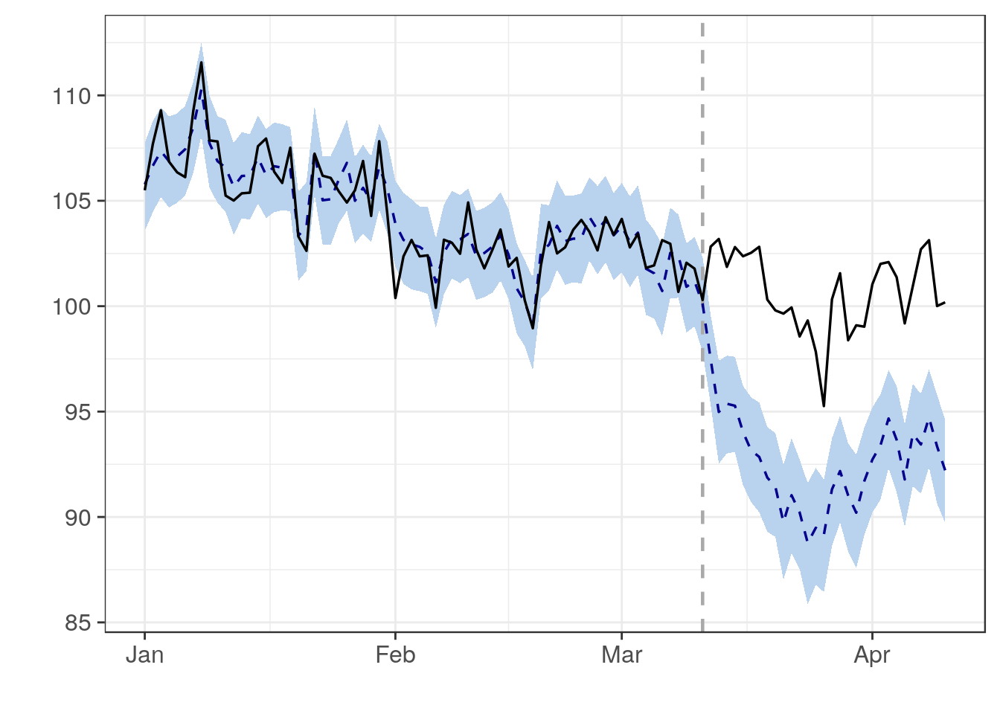

# Experimentación y algoritmos de tragamonedas (bandits)

En esta sección consideramos el problema de hacer cambios
en un sitio web, por ejemplo, con el fin de mejorar métricas
como conversiones, ventas, tráfico, tasas de click-through, etc.

## Causalidad y contrafactuales

Para entender por qué este problema no es trivial, consideremos aquí un caso en
que alguien hace una modificación del algoritmo de búsquedas de una tienda online. Por ejemplo: quizá estamos pensando
en usar un nuevo algoritmo para ordenar los resultados de una búsqueda
en la tienda.

En algunos casos es claro que nuestro cambio representa una mejora (por ejemplo, cuando arreglamos un *bug*), pero muchas veces no estamos muy
seguros de que el cambio vaya a ser beneficioso. En este ejemplo,
podriamos tomar como métrica de interés el número de conversiones: cuántas de las búsquedas terminan en acciones positivas (compras, añadir a canasta, etc.)

Una primera aproximación es hacer el cambio, y observar las métricas de interés. 
Sin embargo, los números resultantes **pueden ser difíciles de interpretar**: por ejemplo,
si hicimos el cambio justo antes de navidad, es
normal esperar más compras resultantes de las búsquedas, pues en promedio
la gente que llega está más decidida a comprar que en otros periodos.
Esto no quiere decir que nuestro cambio fue positivo, pues quizá las 
ventas hubieran sido aún mayores si no hubiéramos hecho el cambio.

Otra aproximación simplista en los negocios es comparar *year over year*, por ejemplo, comparamos esta navidad con las anteriores. Esto también da un
resultado difícil de interpretar, pues estamos comparando dos periodos
alejados en el tiempo.

```{block2, type="resumen"}
Desde el punto de vista conceptual, lo que quisiéramos saber es *cómo
nos hubiera ido* si no hubiéramos hecho el cambio. Si supiéramos este
resultado, podríamos comparar directamente y evaluar el efecto de nuestro
cambio. A este escenario típicamente no observado le llamamos **contrafactual**, y es útil para razonar en este tipo de problemas.
```

#### Ejemplo {-}

En este ejemplo consideramos un escenario posible (simulado)
```{r, message=FALSE, warning = FALSE, eval=FALSE}
if(!require(CausalImpact)){
  install.packages("CausalImpact")
}
library(CausalImpact)
set.seed(4)
x1 <- 100 + arima.sim(model = list(ar = 0.999), n = 100)
y <- 1.2 * x1 + rnorm(100) # ventas simuladas
y[71:100] <- y[71:100] + 7 # efecto de la intervención en el periodo 70.
time.points <- seq.Date(as.Date("2014-01-01"), by = 1, length.out = 100)
data <- zoo(cbind(y, x1), time.points)
pre.period <- as.Date(c("2014-01-01", "2014-03-11"))
post.period <- as.Date(c("2014-03-12", "2014-04-10"))
impact <- CausalImpact(data, pre.period, post.period)
plot(impact, metrics="original")
```



La línea sólida son las ventas observadas (diarias). La línea vertical señala
cuando se hizo la intervención. La línea punteada es el contrafactual estimado: cuáles hubieran sido las 
ventas si no hubiéramos hecho la intervención. Nótese que un análisis superficial que sólo considera las ventas observadas podría concluir que la intervención no tuvo efecto, pero en realidad la situación es muy diferente: la intervención sostuvo las ventas durante el mes analizado.


- Este análisis se basa en la construcción de **contrafactuales** con modelos dinámicos bayesianos (la idea general
a veces se llama "control sintético". La idea es: supongamos que nuestra métrica 
de interés es $y$. Encontramos una covariable $x_1$, y construimos y validamos un modelo
(con los datos anteriores a la intervención) para $y$ con $x_1$ como covariable.
La covariable $x_1$ debe ser escogida de forma que **tengamos evidencia fuerte** de que esta variable **no será afectada por la intervención**. De este forma, el contrafactual después de la intervención se construye haciendo la predicción de $y$ basada en $x_1$, y nos da una idea de lo que hubiera pasado sin la intervención.

- Por ejemplo, en algunos casos podemos escoger $x_1$ como las ventas de la región $A$, $y$ son la ventas de la región $B$. Nuestra intervención (por ejemplo, una promoción) la aplicamos solamente en la región $B$. Entonces el modelo basado de $y$ en $x_1$ (ventas región $A$, que no es intervenida) nos da el contrafactual para comparar.

Estas ideas son del 
método propuesto en [CausalImpact](https://github.com/google/CausalImpact), 
[@causalimpact]. Se puede ver como una versión más sofisticada y poderosa 
del método de diferencia de diferencias. También puedes leer [@varian], una muy buena
introducción a la estimación de efectos causales en marketing.


## Experimentos A/B

Cuando consideramos cambios a un servicio web, y queremos entender el 
efecto en los usuarios, podemos considerar otra estrategia para 
estimar el efecto de nuestras intervenciones.

Considerando que tenemos un número relativamente grande de visitas,
podemos hacer un **experimento A/B**:
seleccionamos al azar un subconjunto de usuarios para mostrarles

- el sitio **con** la intervención (grupo B), y al resto les mostramos
- el sitio **sin** la intervención (grupo A). 

Como seleccionamos al azar
los usuarios, las poblaciones son comparables en cuanto a demográficos y
tipos de usuarios, y no tenemos problemas de hacer comparaciones fuera de temporalidad.
Comparamos los resultados de los dos grupos
para evaluar el efecto de la intervención.

Nótese que esta estrategia puede no funcionar bien si usamos una asignación
a grupos que no es aleatoria. Un ejemplo típico es considerar el efecto
de un anuncio de *paid search*. Podemos comparar usuarios que recibieron
el anuncio con otros que no lo recibieron, y ver las ventas en cada grupo. Esta comparación típicamente *no* resulta en una buena estimación 
de la cantidad que nos interesa, pues los que recibieron el anuncio
de *paid search* han mostrado más interés en hacer una compra que los que
no lo recibieron (por eso recibieron el anuncio!)

#### Ejemplo {-}

Veamos un ejercicio de simulación. Consideremos dos grupos de usuarios:
interesados y no interesados, que es una variable que no observamos. 
Suponemos que las ventas en cada grupo, independientemente de nuestras
acciones, son más altas para usuarios interesados que no interesados:

```{r, message = FALSE, warning=FALSE}
library(tidyverse)
theme_set(theme_minimal())
compras_int_alto <- rpois(1000, 5)
compras_int_bajo <- rpois(1000, 1)
mean(compras_int_alto)
mean(compras_int_bajo)
```

Nótese que nosotros en principio no podemos hacer esta comparación,
pues *interés* no es una medida que tengamos disponible fácilmente.


Ahora supongamos ahora que las probabilidades de recibir el anuncio de *paid search* es más alto para los interesados que los no interesados (pues usuarios interesados hacen más búsquedas relevantes):

```{r, message=FALSE, warning=FALSE}
library(tidyverse)
ps_int_alto <- 0.04
ps_int_bajo <- 0.01
```

Y simulemos los datos que observaríamos. En primer lugar,
simulamos qué usuarios reciben o no anuncios:

```{r}
anuncio_int_alto <- rbinom(1000, 1, ps_int_alto) 
anuncio_int_bajo <-  rbinom(1000, 1, ps_int_bajo)
head(anuncio_int_alto)
```

Y juntamos los datos que observaríamos:

```{r}
datos <- tibble(anuncio_ps = c(anuncio_int_alto, anuncio_int_bajo),
                compras = c(compras_int_alto, compras_int_bajo))
datos
```


Si hacemos una comparación entre grupos, obtenemos:

```{r}
datos %>% group_by(anuncio_ps) %>% 
  summarise(media_compras = round(mean(compras), 2), n = n(), ee = (sd(compras)/sqrt(n)) %>% round(2))
```

Y vemos que el grupo que recibió anuncio tiene más compras promedio
que el que no recibió anuncio. Sin embargo, en esta simulación
el anuncio no tiene ningún efecto.

Si distribuyéramos al azar la asignación del anuncio,

```{r}
datos %>% mutate(asigna = rbinom(2000, 1, 0.05)) %>% 
  group_by(asigna) %>% 
  summarise(media_compras = round(mean(compras), 2), n = n(), ee = (sd(compras)/sqrt(n)) %>% round(2))
```

Entonces obtenemos una comparación de "peras con peras".

### Aleatorización en experimentos.

Aunque intuitivamente está claro por qué en el ejemplo anterior podemos
obtener el análisis correcto cuando aleatorizamos el tratamiento (en este caso un anuncio), podemos ver algunos detalles matemáticos que explican por qué sucede.

Una manera fácil de entender esto es pensando en contrafactuales. Consideramos
las siguientes variables aleatorias:

- $Y(1)$ = compras de usario si recibe anuncio.
- $Y(0)$ = compras de usuario si no recibe anuncio.

Nos interesa estimar
\begin{equation}
E\left[ Y(1)-  Y(0)\right ] = E[Y(1)]  - E[Y(0)]
(\#eq:difcausal)
\end{equation}

que podemos considerar como el efecto promedio del tratamiento (un anuncio, un cambio en el sitio, etc) sobre la población de usuarios (a veces queremos conocer este valor esperado condicionando al tratamiento: efecto sobre los tratados).

En la práctica, consideramos una muestra de usuarios $Y_1,Y_2,\ldots, Y_n$. Algunos de estos recibirán el tratamiento y otros no, y escribimos $T_i=1$ si $i$ recibió el tratamiento y $T_i=0$ si no lo recibió. Las variables $Y_i$ que observamos
son:

- $Y_i = Y_i(1)$ si $T_i=1$
- $Y_i = Y_i(0)$ si $T_i=0$

La estimación directa de el valor esperado \@ref(eq:difcausal) la haríamos con
el promedio
$$\frac{1}{n}\sum_i \left(Y_i(1) - Y_i(0)\right)$$
y notamos inmediatamente una dificultad: no observamos esta diferencia
para ninguno de los usuarios! Para cada usuario, observamos solamente una
de $Y_i(1)$ o $Y_i(0)$. Los datos, por ejemplo, se verían:

```{r}
datos_obs <- data_frame(i = c(1L,2L,3L,4L,5L), 
           `Y_i(1)` = c(NA, 5L, 3L, NA, NA),
           `Y_i(0)` = c(2L, NA, NA, 3L, 2L), 
            T=c(0L,1L,1L,0L,0L),
            Y_i=c(2L,5L,3L,3L,2L))
datos_obs
```

En cada caso, necesitamos el **contrafactual** de cada observación para poder
estimar el efecto promedio de nuestra intervención.

Nótese que viendo el lado derecho de \@ref(eq:probacola) podríamos intentar
hacer la *estimación estándar*, que consiste en tomar los promedios
de las columnas de los datos anteriores y promediar:
\begin{equation}
 \frac{1}{n_1} \sum_{T_i = 1} Y_i - \frac{1}{n_0} \sum_{T_i=0} Y_i.
(\#eq:estandar)
\end{equation}

donde promediamos los resultados de los tratados y restamos el promedio
de los no tratados.  En nuestro ejemplo, haríamos:

```{r}
mean.na <- function(x){ mean(x, na.rm = T)}
datos_obs %>%  
  summarise(media_tratados = mean.na(`Y_i(1)`),
            media_no_tratados = mean.na(`Y_i(0)`)) %>%
  mutate(diferencia = media_tratados - media_no_tratados)
```

Ahora consideremos por qué esta estimación puede tener sesgo alto.
El promedio $\frac{1}{n_1} \sum_{T_i = 1} Y_i$ es realmente una estimación
de 
$$E[Y|T = 1] = E[Y(1)|T=1]$$
Así que cuando la asignación del tratamiento está asociada a la variable
de respuesta $Y$, esta última cantidad no es necesariamente igual
a $E\left(Y(1)\right)$. Explica en tus palabras por qué pasa esto (puedes comenzar
con el ejemplo de *paid search* que vimos arriba).

Igualmente, el promedio $\frac{1}{n_0} \sum_{T_i = 0} Y_i$ estima
la cantidad
$$E[Y|T = 0] = E[Y(0)|T=0]$$
que no necesariamente es igual a $E[Y(0)]$. En general, estamos comparando "peras con manzanas",
pues los tratados y los no tratados pueden ser subpoblaciones muy distintas cuando el
tratamiento se asigna de manera "natural".


```{block2, type="resumen"}
El que a veces se llama el **problema fundamental de la inferencia causal** es
que nunca observamos los efectos causales directamente, pues nunca observamos
juntos el resultado más su contrafactual.
```


Con un experimento, sin embargo, podemos superar este problema.
Si **asignamos el tratamiento de manera aleatoria**, entonces
por definición $E(Y(0)) = E\left(Y(0)|T=0\right)$ y $E\left(Y(1)\right) = E\left(Y(1)|T=0\right)$ ($T$
es una variable aleatoria que no está correlacionada con ninguna otra variable),
y el estimador estándar \@ref(eq:estandar) es un estimador insesgado 
de la cantidad que nos interesa, que es \@ref(eq:difcausal).


## Costos de experimentación

Ahora supongamos que para simplificar nuestra vida, y tener resultados
sólidos, decidimos hacer un experimento $A/B$ en nuestro sitio web. Decidimos
entonces, cada vez que un usuario pide una página $x$, tiramos un volado y decidimos
si le enseñamos la versión $A$ y la versión $B$. Lo que hace este usuario en el resto
de su sesión estará registrado en los logs del sitio (o en una base de datos si
nuestra aplicación registra los resultados de interés). Podemos entonces, después
de tener un número apriopiado de usuarios en cada rama $A$ y $B$, comparar los
dos grupos y tomar una decisión final acerca de qué versión nos conviene.

Las primeras objeciones que podemos hacer a esta decisión (y que muchos interesados
en el negocio seguramente plantearán):

- El experimento representa un riesgo al ingreso del sitio o el éxito del negocio. Si la modificación es contraproducente, entonces la duración del experimento representa pérdidas para el negocio. Por ejemplo, si decidimos hacer un experimento para saber si un anuncio está funcionando, en lugar de mostrar el anuncio a todos los usuarios que califican, solo una fracción lo recibirá. Esto representa pérdidas potenciales grandes. **Respuesta**: esto es cierto, en términos de ganancias a corto plazo.  Pero también es necesario ver el *trade-off*: que a mediano y largo plazo, hacer experimentación de manera más generalizada puede avanzar mejor el negocio y dar más seguridad en la toma de decisiones.

- Hay también un costo técnico en establecer la infraestructura para hacer y analizar los experimentos adecuadamente.  **Respuesta**: esto es cierto.

- El camino de la experimentación muchas veces es contrario al pensamiento de los analistas de negocios/tomadores de decisiones, que a veces prefieren hacer análisis diseñados para entender el potencial de cambio *antes* de hacer ningún cambio. Por ejemplo encuestas, pruebas en focus groups, etc. **Respuesta**: el análisis ad-hoc es una herramienta poderosa, pero también muchas veces plagada de incertidumbre no siempre explícita (por ejemplo, muy dependiente del tipo de modelos que se consideran, o de los datos que se tienen a mano). Es posible combinar las dos aproximaciones.

En particular, los experimentos $A/B$ (que pueden tener más de $2$ opciones) tienen la debilidad de que

- Cuando hacemos experimentación, generalmente decidimos cuánto tiempo va a durar el experimento para tener tamaños de muestra adecuados. En algunos casos, las opciones son tan malas o tan buenas en relación a otras que esto es un desperdicio de dinero (podemos descartar una opción rápidamente por ser muy mala). 

- Desde el punto de vista del negocio, preferiríamos una solución donde cuanto más mala parece ser una opción, la exploramos menos para incurrir en menos pérdidas grandes. Sin embargo, queremos mantener algún nivel de exploración para poder encontrar mejores opciones a la que tenemos actualmente, especialmente cuando tenemos incertidumbre alta acerca de una opción.

- Muchas veces, se considera que lo más importante de controlar es el error tipo I (declarar
un cambio como mejoría cuando realmente es más o menos equivalente a lo que teníamos antes) mediante
algún nivel de significancia ($5\%$). En la práctica, 
nos preocupan más los errores de tipo II (no escoger un cambio que representa ganancias grandes), especialmente cuando el costo
de hacer cambios es relativamente bajo, como en el caso de páginas web
o algoritmo de machine learning usado, por ejemplo.


## Algoritmos de tragamonedas

Los algoritmos de tragamonedas (multi-armed bandit algorithms) buscan 
dar soluciones a las deficiencias que acabamos de señalar en el esquema
de experimentación A/B. La idea básica es que para optimizar nuestro
sitio web (por ejemplo), necesitamos balancear dos tipos de acciones:

- **Exploratorias**: donde probamos nuevas opciones para ver cómo se desempeñan.
- **Explotadoras**: donde aplicamos las mejores opciones (hasta donde tenemos evidencia) para tener buenos resultados de negocio.

Estas dos caras son indispensables para la optimización: ninguna
tiene mucho sentido sin la otra.

El proceso que nos interesa lo formulamos como una máquina tragamonedas,
donde jalamos palancas y obtenemos resultados aleatorios:

```{block2, type="resumen"}
Una tragamonedas de $n$ brazos es un proceso aleatorio, donde:

- Escogemos uno de $n$ palancas de la tragamonedas
- Obtenemos una recompensa aleatoria, cuya distribución depende de la palanca que escogimos.

¿Cómo debemos operar la máquina para lograr maximizar en algún
sentido nuestra recompensa?
```

El material de esta sección está parcialmente basado en [@whitebandits]. También puedes
revisar el código de libro (python, julia, r) en [este repositorio](https://github.com/johnmyleswhite/BanditsBook).

#### Ejemplos {-}
Probemos como lucirían los datos obtenidos de una tragamonedas, y cómo podríamos
ir tomando decisiones acerca de qué brazos probar

```{r}
crear_maquina_poisson <- function(lambda){
  # utilizamos recompensas poisson con distintas medias lambda
  n_brazos <- length(lambda)
  simular_maquina <- function(brazo){
      rpois(1, lambda = lambda[brazo])
  }
  simular_maquina
}
crear_maquina_bernoulli <- function(lambda){
  # utilizamos recompensas poisson con distintas medias lambda
  n_brazos <- length(lambda)
  simular_maquina <- function(brazo){
      rbinom(1, 1, p = lambda[brazo])
  }
  simular_maquina
}
sim_1 <- crear_maquina_poisson(lambda = c(1, 5, 8))

```

Ahora empezamos a explorar:

```{r}
set.seed(2123)
#jalamos el brazo 2
sim_1(2)
# probemos otro
sim_1(3)
# el brazo 2 parece mejor, pero estamos seguros? Probemos más
sim_1(2)
sim_1(3)
# quizá el brazo 3 es mejor
sim_1(2)
sim_1(3)
```

```{r}
sim_1(3)
```

Pero ahora nos damos cuenta: quizá el brazo 1 es mucho mejor y hemos estado perdiendo
el tiempo en los brazos 2 y 3!

```{r}
sim_1(1)
sim_1(1)
sim_1(1)

```

Parecen mejor los brazos 2 y 3. Veamos un resumen del desempeño :

```{r}
brazo_1 <- c(0, 1, 3)
brazo_2 <- c(10, 3, 7)
brazo_3 <- c(6, 13, 11, 3)
sprintf("Brazo 1: Media %.3f, Error estándar %.3f", mean(brazo_1), sd(brazo_1)/sqrt(length(brazo_1)))
sprintf("Brazo 2: Media %.3f, Error estándar %.3f", mean(brazo_2), sd(brazo_2)/sqrt(length(brazo_2)))
sprintf("Brazo 3: Media %.3f, Error estándar %.3f", mean(brazo_3), sd(brazo_3)/sqrt(length(brazo_3)))
```

Y nos damos cuenta de que todavía tenemos que explorar más, aunque los brazos 2 y 3 se ven
mejores que el 1.


---

Puntos importantes:

- Las datos que hemos visto de una palanca dada son evidencia del desempeño de la palanca,
pero no podemos decidir con 100\% de seguridad cuál es su desempeño, pues
existe variación muestral.
- En general, queremos **explorar** palancas que tengan poca evidencia (datos) para entender
mejor su nivel de recompensas y ver si son buenas.
- Pero también tenemos que **explotar** palancas cuya evidencia es de recompensa alta para no 
perder dinero en el proceso de experimentación. Queremos también evitar palancas que han dado evidencia de ser inferiores.
- Un esquema de **exploración-explotación** es un punto medio entre la visión del experimentador
clásico y de los intereses del negocio.
- En un experimento clásico (A/B), generalmente fijamos el tamaño de muestra que queremos para hacer
nuestro análisis estadístico. Pero en una tragamonedas,
la asignación es dinámica, y puede depender tanto
del tamaño de muestra como de los niveles de recompensa que hemos observado.


```{block2, type='resumen'}
También obsérvese que en cualquier caso, un algoritmo para resolver una tragamonedas
debe **involucrar aleatorización**: asignación aleatoria de los usuarios (o las pruebas)
a los distintos posibles brazos. Esto nos permite comparar directamente los resultados sin
preocuparnos por corregir o considerar sesgo debido a asignaciones no aleatorias de los
usuarios o las pruebas.
```

En optimización de sitios web, las palancas son las distintas opciones
que podemos presentar a los usuarios, por ejemplo, 3 algoritmos de 
ordenación de resultados. Cada usuario es una jugada en la máquina
tragamonedas, y la recompensa es la métrica de desempeño que hayamos escogido
(por ejemplo, conversiones). 


## Algoritmo epsilon-miope

Idea: casi siempre escoger la que parece ser la mejor opción (media más alta, por ejemplo), 
con los datos que tenemos al momento. Pero de vez en cuando (con cierta
probabilidad) escogemos una opción al azar.

Sea $\epsilon > 0$, y supongamos que nuestra máquina tiene $n$
brazos. Cuando llega un usuario,

- Con probabilidad $1-\epsilon$ le presentamos la mejor opción que tenemos ahora
- Con probabilidad $\epsilon$ es escogemos al azar alguna de las $n$ opciones.


Antes de seguir, probamos el simulador que construimos 
arriba y gráficamos los resultados para cada brazo:

```{r, fig.height = 4, fig.width = 3}
simular <- crear_maquina_poisson(lambda = c(1, 8, 10))
sim_recomp <- 
  data_frame(brazo = sample.int(3, 3000, replace = TRUE)) %>% 
  mutate(recompensa = map_dbl(brazo, simular)) %>%
  group_by(brazo) %>% mutate(media = mean(recompensa))
ggplot(sim_recomp, aes(x=recompensa)) + facet_wrap(~brazo, ncol = 1) +
  geom_histogram(binwidth = 1) +
  geom_vline(aes(xintercept = media), colour = 'gray')
```


Ahora construimos nuestra función para el algoritmo e-miope

```{r}
crear_epsilon_miope <- function(epsilon, inicial = 1, sim_fun){
  n_brazos <- environment(sim_fun)$n_brazos
  conteos <- rep(0, n_brazos)
  iteracion <- 0
  #recompensas <- vector("list", n_brazos)
  sumas <- rep(0, n_brazos)
  S <- rep(0, n_brazos)
  mejor <- inicial
  epsilon <- epsilon
  fun <- function(){
    if(runif(1) <= epsilon){
      #explorar
      brazo <- sample.int(n_brazos, 1)
    } else {
      #explotar
      brazo <- mejor
    }
    sim <- sim_fun(brazo)
    #recompensas[[brazo]] <<- c(recompensas[[brazo]], sim)
    media_ant <- ifelse(conteos[brazo] > 0, sumas[brazo] / conteos[brazo], 0)
    conteos[brazo] <<- conteos[brazo] + 1
    sumas[brazo] <<- sumas[brazo] + sim
    media <- sumas[brazo] / conteos[brazo]
    S[brazo] <<- S[brazo] + (sim - media_ant)*(sim - media)
    mejor <<- which.max(sumas /conteos)
    iteracion <<- iteracion + 1
    estado <- data_frame(n = iteracion,
                         brazo = 1:n_brazos,
                         conteo = conteos,
                         suma = sumas, 
                         media = sumas / conteos,
                         ee = sqrt(S / conteos)/sqrt(conteos))
    return(estado)
  }
  fun
}
```


Y veamos algunas corridas:

```{r}
set.seed(9233)
e_miope <- crear_epsilon_miope(epsilon = 0.5, inicial = 1, 
                               sim_fun = simular)
e_miope()
e_miope()
```

Y ahora generamos 100 datos adicionales y guardamos los resultados:

```{r}
e_miope <- crear_epsilon_miope(epsilon = 0.3, inicial = 1, sim_fun = simular)
df_iteraciones <- lapply(1:600, function(i){
  e_miope()
}) %>% bind_rows %>% as_tibble()
df_iteraciones 
```

Y consideramos la recompensa promedio acumulada a cada momento
del tiempo:
```{r}
resumen <- df_iteraciones %>% group_by(n) %>%
  summarise(promedio_recompensa = sum(suma) / sum(conteo))
ggplot(resumen, aes(x = n, y = promedio_recompensa)) + geom_line() +
  geom_hline(yintercept = 10, colour = "red")
```

Nótese que esperamos que conforme pasa el tiempo, vamos explorando
las distintas opciones, y el algoritmo identifica
correctamente la mejor opción (la que tiene promedio más alto). Este balance
hace que típicamente  la recompensa promedio vaya subiendo. 
La exploración nos permite juntar datos incluso
de las opciones más malas para tomar mejores decisiones en el futuro. 

La línea roja corresponde a la decisión de tomar la mejor decisión en cada
iteración. Nótese que este algoritmo alcanza una fracción de este nivel óptimo,
pues constantemente hace exploración (con probabilidad $\epsilon$) de otras
opciones.

Podemos ver cómo van compitiendo los brazos en el tiempo:

```{r, message = FALSE, warning=FALSE}
ggplot(df_iteraciones, aes(x = n, y = suma / conteo, 
       group = brazo, colour = factor(brazo))) + geom_line()
```

Y podemos considerar intervalos (por ejemplo, de 2 errores estándar) 
para la estimación de la recompensa promedio de cada brazo:

```{r, message=FALSE, warning=FALSE}
df_iteraciones <- df_iteraciones %>% group_by(brazo) %>%
    mutate(promedio = suma / conteo) 
ggplot(df_iteraciones, aes(x=n, y=promedio, 
        ymin = promedio - 2*ee,
        ymax = promedio + 2*ee, 
        colour = factor(brazo), group = brazo)) +
  geom_line() + geom_ribbon(alpha = 0.1)
```

Obsérvese que nuestro método no utiliza en ninguna forma la incertidumbre que
tenemos en las estimaciones de la recompensa promedio. Veremos más adelante cómo
mejorar esta deficiencia.

### Comparación con experimentación clásica

En experimentación usual, siempre asignamos aleatoriamente el brazo (por una cantidad
de tiempo inicial fija), de forma que $epsilon=1$,
y después siempre escogemos el mejor brazo $epsilon = 0$. Es decir: al principio exploramos
intentando encontrar muestras balanceadas en tamaño para cada brazo, y al final
solo explotamos.


```{r}
set.seed(9322)
e_miope <- crear_epsilon_miope(epsilon = 0.1, inicial = 1, sim_fun = simular)
e_ab <- crear_epsilon_miope(epsilon = 1.0, inicial = 1, sim_fun = simular)
tiempo <- 500

df_iteraciones <- lapply(1:500, function(i){
  if(i==301){
    # si llegamos al tiempo 300 dejamos de explorar, y solo explotamos
    assign("epsilon", 0.0, environment(e_ab))
  }
  dat_miope <- e_miope()
  dat_ab <-  e_ab()
  dat_miope$tipo <- "miope"
  dat_ab$tipo <- "ab"
  bind_rows(dat_miope, dat_ab)
}) %>% bind_rows %>% as_tibble()
```

Veamos

```{r}
df_resumen <- df_iteraciones %>% group_by(n, tipo) %>% 
  summarise(promedio = sum(suma) / sum(conteo))
ggplot(df_resumen, aes(x=n, y = promedio, group = tipo, colour = tipo)) +
  geom_line() + labs(title = "Desempeño") +
  geom_vline(xintercept = 300, colour = "gray")
```

**Observaciones**:

1. Nótese que en el periodo de experimentación, el algoritmo a/b tiene pérdidas comparado
con el algoritmo epsilon-miope. Esto es porque en toda esta etapa no tomamos las decisiones
usando las recompensas observadas.
2. Muy al principio, el algoritmo epsilon-miope pierde más que el a-b. Esto es porque al principio
está explotando un brazo muy malo. Una vez que explora los otros brazos, sin embargo, la explotación
mejora y supera en costo al método a/b.
3. Nótese que a largo plazo el algoritmo a/b superará en promedio al miope en recompensa promedio (una vez que dejamos de experimentar y ya identificamos correctamente la mejor opción). El algoritmo miope, por otro lado, sigue explorando opciones malas una fracción del tiempo, lo cual quizá ya no sería necesario.

Podemos graficar también el acumulado, donde vemos de otra manera
la brecha entre los dos métodos en cuanto a recompensa acumulada en el tiempo:

```{r}
df_resumen <- df_iteraciones %>% group_by(n, tipo) %>% 
  summarise(acumulado = sum(suma))
ggplot(df_resumen, aes(x=n, y = acumulado, group = tipo, colour = tipo)) +
  geom_line() + labs(title = "Desempeño")

```

**Preguntas**: 

- Estas gráficas muestran una corrida particular de recompensas observadas. Corre con
otra semilla para ver otras maneras en las que se pueden comportar estos algoritmos.
- ¿Cuál es el riesgo de correr por muy poco tiempo la fase de experimentación en el algoritmo
a/b?
- ¿Cuál es el riesgo de correr demasiado tiempo la fase de experimentación en el algoritmo a/b?
- ¿Cómo se vería en estas gráficas un algoritmo perfecto (ninguno tiene
mejor recompensa acumulada en ningún tiempo)? Añade estos límites teóricos (que en la práctica
no conocemos) a las gráficas de arriba.
- Compara el desempeño del algoritmo miope con distintos valores de $\epsilon$.

### Desventajas del algoritmo miope {-}

- Al principio, el algoritmo miope pierde tiempo explotando opciones que muchas veces son malas
(pues no hay información).
- Al final, cuando tenemos más datos, el algoritmo miope pierde tiempo explorando opciones 
que tienen mucha evidencia en su contra.
- En parte, esto se debe a que el algoritmo no toma en cuenta el error de estimación (tamaño de muestra). Pero también se debe a que el algoritmo, cuando entra en exploración, escoge
con igual probabilidad todas las opciones.


## Algoritmo softmax

En esta parte consideramos una primer mejora al algoritmo miope incorporando parte del
esquema de experimentación a/b

- Escogeremos ramas para explorar dependiendo de qué tan bien se han desempeñado en el pasado.
- Usamos una idea de recocido simulado: al principio, no tomamos en cuenta tanto las recompensas observadas (pues tenemos poca muestra), pero conforme pasa el tiempo nos concentramos más en explotar
las ramas que tienen desempeño promedio más alto.


Para implementar la primera idea, supongamos que tenemos $k$ ramas, y al tiempo $n$ los promedios de recompensa para cada rama son
$$\hat{r}_1, \hat{r}_2, \ldots, \hat{r}_k.$$
La idea es escoger la rama $j$ con probabilidad

$$p_j = \frac{\exp({\hat{r}_j})}{\sum_i \exp({\hat{r}_i})}$$
Nótese que las $p_j$'s están entre 0 y 1 y suman 1. La probabilidad de un brazo es más
grande cuanto más grande sea su recompensa relativamente a las otras ramas.

Podemos hacer más flexible nuestra construcción de probabilidades agregando un parámetro $T>0$
de temperatura, y poniendo
$$p_j (T) = \frac{\exp({\hat{r}_j/T})}{\sum_i \exp({\hat{r}_i}/T)}$$

#### Discusión {-}
El efecto de $T$ es dispersar las probabilidades o concentrarlas en la mejor opción. Supogamos
que tenemos cinco brazos con recompensa promedio en un momento dado de 1,4,5,2,1:

```{r}
r <- c(1, 4, 5, 2, 1)
softmax <- function(r, tau){
  exp(r/tau) / sum(exp(r/tau))
}
softmax_tau <- data_frame(tau = c(0.1, 0.7, 2, 5, 20)) %>%
  mutate(df = map(tau, function(t){
    data_frame(brazo = 1:length(r), p = softmax(r, t))
  })) %>% unnest

ggplot(softmax_tau, aes(x=brazo, y=p, fill=factor(tau), group=tau)) + 
  geom_bar(position="dodge", stat = "identity") + facet_wrap(~tau)
```

---


El parámetro $T$ debe ser fijado, y depende de la escala de las recompensas. Si las
recompensas tienen una escala más grande (por ejemplo miles en lugar de decenas),
es necesario hacer $T$ más grande para dispersar más las probabilidades.

Ahora definimos el proceso para hacer más exploración al principio y más explotación al final.
La idea viene del *recocido simulado*, donde al inicio hacemos la temperatura más alta (más exploración), y luego reducimos gradualmente la temperatura para ir explotando más 
las mejores opciones. La idea es poner
$$\tau_{n+1} = \frac{\tau_0}{\log(n)}$$

De forma que cuando $n$ crece, la temperatura baja y hacemos más explotación (al principio
la temperatura es infinita, lo que implica que escogemos al azar entre los brazos). 


Ahora implementamos el algoritmo:

```{r}
crear_softmax <- function(temp_0 = 1, inicial = 1, sim_fun, recocido = F){
  n_brazos <- environment(sim_fun)$n_brazos
  conteos <- rep(0, n_brazos)
  sumas <- rep(0, n_brazos)
  iteracion <- 0
  fun <- function(){
    iteracion <<- iteracion + 1
    if(recocido){
      temperatura <- temp_0 / log(iteracion + 0.0001)
    }
    promedio <- sumas / (conteos + 1)
    m <- max(promedio / temperatura)
    exp_sumas <- exp(promedio / temperatura - m)
    probs <- exp_sumas / sum(exp_sumas)
    brazo <- sample(1:n_brazos, 1, prob = probs)
    sim <- sim_fun(brazo)
    conteos[brazo] <<- conteos[brazo] + 1
    sumas[brazo] <<- sumas[brazo] + sim
    estado <- data_frame(n = iteracion,
                         brazo = 1:n_brazos,
                         conteo = conteos,
                         suma = sumas)
  }
  fun
}
```


```{r}
set.seed(1332)
smax_1 <- crear_softmax(temp_0 = 1.0, inicial = 3, recocido = TRUE, sim_fun = simular)
smax_2 <- crear_softmax(temp_0 = 0.1, inicial = 3, recocido = TRUE, sim_fun = simular)
smax_3 <- crear_softmax(temp_0 = 25.0, inicial = 3, recocido = TRUE, sim_fun = simular)
metodos <- list(softmax_t_10 = smax_1, 
                softmax_t_01 = smax_2, 
                softmax_t_100 = smax_3)

df_iteraciones <- lapply(1:500, function(i){
  resultados <- lapply(1:length(metodos), function(i){ 
    metodos[[i]]() %>% mutate(tipo = names(metodos)[i]) })
  bind_rows(resultados)
}) %>% bind_rows %>% as_tibble()
tail(df_iteraciones, 200)
```

Y consideramos la recompensa promedio acumulada a cada momento
del tiempo:
```{r}
resumen <- df_iteraciones %>% group_by(n, tipo) %>%
  summarise(promedio_recompensa = sum(suma) / sum(conteo))
ggplot(resumen, aes(x=n, y= promedio_recompensa, colour = tipo, group = tipo)) + geom_line() +
  geom_hline(yintercept = 10, colour = "red")
```

**Observaciones**:

1. Nótese que el algoritmo con temperatura inicial muy baja no explora suficientemente, y rápidamente pasa a explotar un brazo subóptimo.
2. El algoritmo con temperatura inicial muy alta sigue explorando, y empieza a utilizar la evidencia de los mejores brazos más tarde.
3. El algoritmo como temperatura inicial 10 parece tener un buen balance: explora los suficiente
para encontrar el mejor brazo y luego se concentra en explotarlo.

### Desventajas del algoritmo softmax

Este algoritmo es una mejora sobre los dos anteriores, pero es necesario escoger una
temperatura inicial correcta. Esta temperatura inicial correcta depende de las distribuciones
de recompensas de cada brazo (por ejemplo, si hay más varianza, necesitamos temperaturas más
altas para que el algoritmo explore más tiempo). Pero inicialmente no necesariamente sabemos
mucho acerca de estas recompensas.

El problema sigue siendo que esta heurística no examina estadísticamente los datos
que ha observado para decidir cuándo es tiempo de explorar, y qué explorar, y cuándo es
tiempo de explotar. Es decir, necesitamos evaluar estadísticamente la evidencia que tenemos
de cada brazo para tomar en cada paso la mejor decisión. Los siguientes dos algoritmos
consideran este aspecto.

## El algoritmo de cota superior de confianza (UCB)

Los algoritmos mostrados arriba tienen el defecto de que no toman en cuenta
la incertidumbre que tenemos acerca de nuestra estimación de la recompensa
promedio de cada brazo. Una buena ventaja de considerar esta incertidumbre es que
la afinación de las probabilidades de exploración durante el algoritmo no deben
ser ajustadas a mano (por ejemplo con la temperatura inicial, o la selección de $\epsilon$).

Supogamos que todas las recompensas están entre 0 y 1 (quizá es necesario escalar). Ahora
supongamos que al momento $t$ tenemos:

- Hemos probado la palanca $k$ $n_{k,t}$ veces
- El promedio de recompensa de cada palanca es $\bar{r}_{k,t}$

Es más o menos claro que medidas de dispersión de las recompensas de cada palanca nos
ayudaría a resolver este problema, pero también es necesario guardar más datos y procesarlos
cuando hacemos el experimento. Sin embargo, podemos dar una cota burda para el verdadero
valor medio $r_k$ de recompensa para la palanca $k$. 

Para el siguiente teorema, consideramos un brazo particular con media observada $\bar{r}$,
media real $r$, y número de observaciones $n$. Suponemos como dijimos antes que cada recompensa están entre 0 y 1.

```{block2, type="resumen"}
**Cotas de Hoeffding**
  
Sea $r_1,\ldots, r_n \in [0,1]$ variables aleatorios iid con $E(r_i) = r$. Entonces
  
$$P(\bar{r} \geq r + a) \leq \exp( -2na^2)$$, y

$$P(\bar{r} \leq r - a) \leq \exp( -2na^2)$$
```

De este resultado podemos hacer un análisis optimista de las cotas superiores de ganancia. Si ponemos $\delta = \exp( -2na^2)$, despejando obtenemos

$$P \left (r > \bar{r} + \sqrt{\frac{log(1/\delta)}{2n}}\right )\leq \delta$$
Si fijamos una $\delta >0$, entonces para cada uno de los brazos, obtenemos una
cota inferior para la recompensa promedio real de
$$ c_{i,t} = \bar{r}_{i,t} + \sqrt{\frac{ log(1/\delta)}{2n_{i,t}}}$$
La idea es entonces escoger el brazo cuya cota es más grande. Este es un punto 
de vista **optimista**: si la cota es grande entonces decidimos explorar el brazo porque es
prometedor - aunque no hay garantía de que podamos superar la cota.

En principio podríamos correr el algoritmo con una $\delta$ fija, por ejemplo $\delta=0.10$.
Veamos por qué esto no necesariamente es buena idea, pues puede ser que dejemos
de explorar prematuramente, y eso nos haría perder muchas recompensas. Como esto puede pasar 
es como sigue:

- Imaginemos que en un momento dado $T$, el mejor brazo es $j$, con constante correpondiente $c_{j,T}$.
- A partir de ese momento, empezamos a explotar $j$. La cota $c_{j,t}$ correspondiente a $j$ ser irá encogiendo hacia la media $\bar{r}_{j,t}$.
- Ahora supongamos que la segunda mejor $k$ opción al tiempo $T$ tiene $c_{k,T} < {\bar{r}_{j,t}}$. Como la opción $j$ sigue ganando, nunca exploraremos $k$ otra vez.
- Sin embargo, hay una probabilidad baja (menor a 10\%) de que de hecho la media verdadera
$r_{k}$ de $k$ esté
**por encima** de su cota $c_{k,T}$. De forma que debería seguir siendo un candidato a 
explorar!

Podemos resolver este problema reduciendo el valor de $\delta$ conforme el tiempo avanza.
En el algoritmo UCB1 (Ver [@auerbandits]) ponemos


$$ c_{i,t} = \bar{r}_{i,t} + \sqrt{\frac{ 2log(t)}{n_{i,t}}},$$

de forma que la cota tiene probabilidad $\delta = t^{-4}$. Adiconalmente, esta selección
particular permite tener cotas teóricas acerca de la máxima pérdida (también llamada *regret*)
que incurrimos al usar este algoritmo.


Implementamos el algoritmo UCB1 como sigue

  
```{r}
crear_ucb <- function(inicial = 1, sim_fun, max = 1){
  n_brazos <- environment(sim_fun)$n_brazos
  conteos <- rep(0, n_brazos)
  sumas <- rep(0, n_brazos)
  iteracion <- 0
  fun <- function(){
    iteracion <<- iteracion + 1
    cotas <- (sumas / max) / conteos  +  sqrt(2* log(iteracion) / conteos)
    cotas[is.nan(cotas)] <- Inf
    brazo <- which.max(cotas)
    sim <- sim_fun(brazo)
    conteos[brazo] <<- conteos[brazo] + 1
    sumas[brazo] <<- sumas[brazo] + sim
    estado <- data_frame(n = iteracion,
                         brazo = 1:n_brazos,
                         conteo = conteos,
                         suma = sumas)
  }
  fun
}
```


```{r}
set.seed(92329)
sim_2 <- crear_maquina_bernoulli(lambda = c(0.01,  0.99, 0.2, 0.1,0.1))
ucb <- crear_ucb(inicial = 1, sim_fun = sim_2)
smax <- crear_softmax(temp_0 = 1.5, inicial = 1, recocido = TRUE, sim_fun = sim_2)
miope <- crear_epsilon_miope(epsilon = 0.1, inicial = 1, sim_fun = sim_2)

metodos <- list(ucb = ucb, 
                softmax = smax, 
                miope = miope)

df_iteraciones <- lapply(1:500, function(i){
  resultados <- lapply(1:length(metodos), function(i){ 
    metodos[[i]]() %>% mutate(tipo = names(metodos)[i]) })
  bind_rows(resultados)
}) %>% bind_rows %>% as_tibble()
```

Y consideramos la recompensa promedio acumulada a cada momento
del tiempo:
```{r}
resumen <- df_iteraciones %>% group_by(n, tipo) %>%
  summarise(promedio_recompensa = sum(suma) / sum(conteo))
ggplot(resumen, aes(x=n, y= promedio_recompensa, colour = factor(tipo), group=tipo)) + geom_line()  +
  geom_hline(yintercept = 0.99, colour = 'red')
```

Podemos correr varias simulaciones para ver cómo se comportan bajo distintos
patrones de recompensas

```{r}

correr_algos <- function(metodos = metodos, t = 300){
  ucb <- crear_ucb(inicial = 1, sim_fun = sim_2)
  smax <- crear_softmax(temp_0 = 1, inicial = 3, recocido = TRUE, sim_fun = sim_2)
  miope <- crear_epsilon_miope(epsilon = 0.1, sim_fun = sim_2)

  metodos <- list(ucb = ucb, 
                softmax = smax, 
                miope = miope)
  df_out <- lapply(1:t, function(i){
    resultados <- lapply(1:length(metodos), function(i){ 
        metodos[[i]]() %>% mutate(tipo = names(metodos)[i]) 
    })
    bind_rows(resultados) }) %>% bind_rows %>% as_tibble()
  df_out
}
replicaciones <- data_frame(rep = 1:6) %>%
  mutate(data = map(rep, function(rep) { correr_algos(metodos) })) %>% 
  unnest(cols = "data")
```

```{r}
resumen <- replicaciones %>% group_by(n, tipo, rep) %>%
  summarise(promedio_recompensa = sum(suma) / sum(conteo))
ggplot(resumen, aes(x=n, y= promedio_recompensa, colour = factor(tipo), group=tipo)) + geom_line()  +
  geom_hline(yintercept = 0.99, colour = 'red') + facet_wrap(~rep)
```

**Observación**:

- Podemos afinar el algoritmo miope y el softmax para tener mejor desempeño con estos datos.
La ventaja de UCB1 es que no tenemos que afinar ningún parámetro, y 
su desempeño es razonable sobre distintas corridas.


## Tragamonedas bayesianos

Los
*tragamonedas bayesianos* presentan una manera más unificada para construir algoritmos
(basados en la distribución posterior de recompensa dada cada brazo). Ver por ejemplo
[Experiments in the Internet age: A modern Bayesian look at the multi-armed bandit](http://web.mi.imati.cnr.it/conferences/BAYSM2016/scott-baysm-bandits.pdf).

La idea general es como sigue: cada brazo $a$ tiene una distribución
$$p_a (y | \theta)$$
de recompensas, que depende de parámetros $\theta$. Tenemos una distribución
previa o inicial 

$$p(\theta).$$

En cada paso $t$, escogeremos al azar entre los brazos con probabilidades
$$w_{1,t},w_{2,t}, \ldots w_{k, t}.$$
Estos pesos queremos seleccionarlos de manera que sea más probable usar
brazos que tengan más evidencia de ser mejores. Así que podemos establecer
qe $w_{a,t}$ como la probabilidad posterior 
de que el brazo $a$ sea el mejor, dada la información $y_1,\ldots, y_{t-1}$.

Explícitamente, si i $I_a(\theta)$ es la función indicadora de "el brazo $a$ es el mejor en valor
esperado", entonces ponemos $w_{a,t}$ como la probabilidad de que
$a$

$$w_{a,t} = E(I_a(\theta) | y_1,\ldots, y_{t-1}).$$

Para calcular este valor esperado, sólo necesitamos la posterior de $\theta$
dados los datos $y_1\ldots, y_{t-1}$, que cumple

$$p(\theta|y_1,\ldots, y_t) \propto p(\theta) \prod_{i=1}^t p_{a_i}(y_i|\theta),$$

Y ahora tenemos todos los ingredientes para nuestra estrategia de exploración
y explotación del tragamonedas

### Ejemplo bernoulli

Podemos hacer el caso Bernoulli, donde las recompensas son 0 o 1 (por ejemplo, el usuario convierte o no). En este caso, cada brazo tiene una probabilidad $\theta_i$
de conversión, que no conocemos al principio. Buscamos el brazo con $\theta_i$ más
grande.

Si la iniciales son $\theta_a\sim U(0,1)$ independientes, entonces es posible demostrar
que las $p_a(\theta|y_1,\ldots, y_{t})$ son distribuciones beta independientes
con parámetros
$$\theta\vert y_1\ldots, y_{t}\sim Beta(Y_{a,t} + 1, N_{a,t} - Y_{a,t} + 1),$$
donde $N_{a,t}$ es el número de veces que se ha usado la palanca $a$ al tiempo $t$,
y $Y_{a,t}$ es el número de 1's observado. Podemos simular de las betas para calcular los pesos $w_{a,t+1}$ de la siguiente forma:


```{r}
crear_bayesiano <- function(sim_fun, num_sims = 1000, a = 1, b = 1){
  n_brazos <- environment(sim_fun)$n_brazos
  conteos <- rep(0, n_brazos)
  sumas <- rep(0, n_brazos)
  iteracion <- 0
  fun <- function(){
    sims_post <- tibble(brazos = 1:n_brazos,
                       conteos = conteos,
                       sumas = sumas) %>% 
      mutate(sims = map2(conteos, sumas,
          function(n, y){
            tibble(sim_no = 1:num_sims, 
                   valor = rbeta(num_sims, y + a, n - y + b))
          })) %>% 
      select(brazos, sims) %>% unnest(cols = "sims") %>% 
      group_by(sim_no) %>% 
      filter(valor == max(valor))
    pesos <- tibble(brazos = 1:n_brazos)  
    resumen <- sims_post %>% ungroup() %>% select(brazos) %>%
      group_by(brazos) %>% 
      summarise(prop = n() / num_sims) 
    pesos <- pesos %>% left_join(resumen, by = "brazos") %>% 
      mutate(prop = ifelse(is.na(prop), 0, prop))
    brazo <- sample(pesos$brazos, 1, prob = pesos$prop)  
    sim <- sim_fun(brazo)
    iteracion <<- iteracion + 1
    conteos[brazo] <<- conteos[brazo] + 1
    sumas[brazo] <<- sumas[brazo] + sim
    estado <- data_frame(n = iteracion,
                         brazo = 1:n_brazos,
                         conteo = conteos,
                         suma = sumas) %>% 
      mutate(inf = map2_dbl(conteo, suma, function(n, y){
        qbeta(0.05, y + a, n - y + b)
      })) %>% 
      mutate(sup = map2_dbl(conteo, suma, function(n, y){
        qbeta(0.95, y + a, n - y + b)
      }))
    estado
  }
  fun
}
```

Y simulamos un ejemplo:

```{r}
set.seed(99770)
lambda <-  c(0.05, 0.30, 0.15, 0.28)
sim_3 <- crear_maquina_bernoulli(lambda = lambda)
bayesiano <- crear_bayesiano(sim_fun = sim_3)
df_iteraciones <- lapply(1:600, function(i){
  bayesiano()
}) %>% bind_rows %>% as_tibble()
tail(df_iteraciones)
ggplot(df_iteraciones, aes(x = n, ymin = inf, ymax = sup)) +
  geom_ribbon(alpha = 0.2) + facet_wrap(~brazo, labeller = label_both) +
  geom_hline(data = tibble(brazo = 1:length(lambda), prob = lambda),
             aes(yintercept = prob), linetype = "dotted", colour = "gray") +
  geom_hline(aes(yintercept = max(lambda)), colour = "red", 
             linetype = "dotted")
```

Podemos usar nuestra información antes del experimento. Por ejemplo,
en el caso de conversiones, las proporciones son muchas veces chicas,
por ejemplo


```{r}
set.seed(99771)
lambda <-  c(0.03, 0.035, 0.01, 0.004)
sim_3 <- crear_maquina_bernoulli(lambda = lambda)
# iniciales beta(1, 6)
quantile(rbeta(1500, 1, 20))
bayesiano <- crear_bayesiano(sim_fun = sim_3, a = 1, b = 20)
df_iteraciones_2 <- lapply(1:1500, function(i){
  bayesiano()
}) %>% bind_rows %>% as_tibble()
ggplot(df_iteraciones_2, aes(x = n, ymin = inf, ymax = sup)) +
  geom_ribbon(alpha = 0.2) + facet_wrap(~brazo, labeller = label_both) +
  geom_hline(data = tibble(brazo = 1:length(lambda), prob = lambda),
             aes(yintercept = prob), linetype = "dotted", colour = "gray") +
  geom_hline(aes(yintercept = max(lambda)), colour = "red", 
             linetype = "dotted")
```

Observaciones:

- Con este esquema, cuando la probabilidad posterior de que $\theta_a > \theta_b$
es muy alta, entonces preferimos casi siempre al brazo $a$ sobre el brazo $b$.
- Es necesario poner iniciales apropiadas para el problema. Por ejemplo,
las conversiones (para muchas definiciones) rara vez superan 5\%, y en muchos casos
son considerablemente menores a 1\%.  Nótese que una especificación incorrecta
de la inicial puede requerir corridas más largas, e intervalos de probabilidad
mal calibrados.
- Este esquema puede aplicarse con eficiencia a esquemas más
complejos, considerando modelos más refinados para $p_a(y|\theta)$. Por ejemplo,
puede haber parámetros compartidos entre los modelos, podemos usar regresión,
etc. La simulación de la posterior en estos casos puede hacerse mediante MCMC,
por ejemplo.


## Otros aspectos de la experimentación y máquinas tragamonedas

Hay varios aspectos que tenemos que cuidar cuando planeamos hacer experimentación online ([@whitebandits):

1. ¿Nuestro código de experimentación y de evaluación está funcionando como debe?
2. ¿Hemos escogido correctamente las métricas que queremos optimizar?
3. ¿Existe información adicional de contexto (por ejemplo, tipo de usuarios) de la queremos
aprender también? (por ejemplo, encontrar valor de los brazos según tipo de usuario).

### Pruebas A/A {-}

Una forma robusta de validar nuestro código y la infraestructura de experimentación es 
correr experimentos A/A antes de nuestras tragamonedas o experimentos A/B. En un experimento
A/A, aplicamos el tragamonedas, pero todos los tratamientos son iguales. Si corremos suficiente
tiempo el experimento, debemos observar que los brazos convergen en desempeño promedio.

Cuando esto no sucede, quiere decir existe un error en nuestra infraestructura de 
experimentación. Estos problemas suceden en la práctica pues esa infraestura es típicamente
no trivial, pues toca todos los puntos de nuestro sitio web. Ver por ejemplo el
paper [trustworthy online controlled experiments five puzzling outcomes explained](http://notes.stephenholiday.com/Five-Puzzling-Outcomes.pdf). Puedes leer más
acerca del diseño de la plataforma completa de experimentación en Google en [Overlapping Experiment Infrastructure: More, Better, Faster Experimentation](https://static.googleusercontent.com/media/research.google.com/en//pubs/archive/36500.pdf).

### Métricas de éxito defectuosas {-}

La experimentación automatizada, bajo las métricas incorrectas de éxito, puede ser
contraproducente. Por ejemplo, la degradación de resultados de búsqueda, en el corto plazo,
puede producir:

- Más clicks por usuario (una métrica posible de éxito), pues es más dificil encontrar los resultados que le interesa al usuario
- Más clicks en anuncios (y más ganancias de publicidad), pues dada la pobreza de los resultados los usuarios recurren artificalmente a los anuncios de *paid search*.
- Más clicks en artículos recomendados, por la misma razón.
Todas estas son ganancias a corto plazo, pero a largo plazo dañan el negocio.

### Tragamonedas contextuales

Podemos también utilizar modelos para obtener recompensas contextuales, en donde construimos
modelos para la recompensas de cada brazo según variables adicionales que tengamos (por ejemplo, tipo de usuario, hora del día, etc.). En los ejemplos que vimos arriba, nos interesaba simplemente
calcular $E(R_i)$ para cada uno de los brazos. Sin embargo, podemos modelar también 
en función de covariables, y estimar $E(R_i|X)$ con algún modelo (por ejemplo, regresión lineal).
Ver por ejemplo [este paper](http://rob.schapire.net/papers/www10.pdf).

